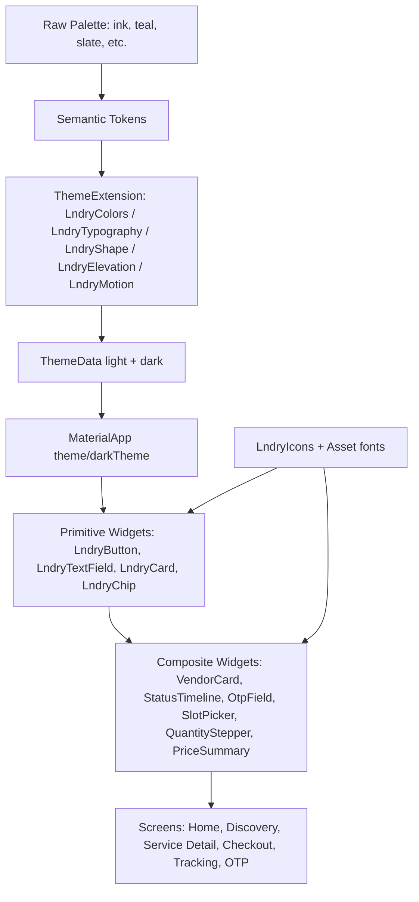

# Design Document: Lndry Visual Design System

> **Type:** Design-First feature spec · **Platform:** Flutter (Dart) · **Primary surface:** Customer app · **Secondary surfaces:** Vendor app, Delivery Partner app
> **Role of author:** Executive frontend / product design — this document is a *visual design pack*, not just an architecture spec. The goal is for Lndry to **feel like an experience**, not merely function.

---

## Overview

Lndry is "India's urban garment-care infrastructure platform" — but the app is a **multi-vendor laundry marketplace** (Swiggy/Zomato-for-laundry) where customers compare and choose among competing vendors. This creates a core design tension we must resolve:

> **The website tells a premium, single-brand story. The app is a marketplace of many vendors.**

This design system resolves that tension with a single principle: **Lndry is the premium frame; vendors are the curated contents.** The platform's chrome (navigation, typography, motion, color, packaging-grade polish) carries the luxury-service feel and the trust guarantee. Vendor cards live *inside* that frame like products in a beautifully merchandised store — clearly comparable, never cheap-looking. The customer never feels like they dropped from a luxury brand into a generic listings app.

Three experiential pillars drive every decision:

1. **Reassurance over anxiety.** The MVP has *no live courier map* — tracking is a status timeline. Rather than treat this as a downgrade, we make the **timeline the emotional centerpiece**: calm, confident, narrated progress that replaces live-map anxiety with a sense of being cared for. OTP handovers are framed as secure, ceremonial moments of trust.
2. **Effortless comparison inside a premium frame.** Vendor cards, sort, and filter UI must make compare-and-choose genuinely effortless, while elevation, type, and spacing keep everything feeling considered and high-end.
3. **Quiet confidence.** Generous whitespace, restrained motion, large bold headings, and a refined custom icon system (never emoji in-app). The brand should feel like "what tech should feel like" — clean, warm, trustworthy.

This document covers brand foundations, the full token system (color, type, spacing, radius, elevation, motion), iconography, a complete component library, screen-by-screen visual storytelling for the customer journey, accessibility, and concrete Flutter implementation (`ThemeData` + `ThemeExtension`, token definitions, and reusable widget specs).

---

## Part I — High-Level Design (Brand Foundations, Tokens & Visual Story)

## 1. Brand Foundations

### 1.1 Brand personality → design attributes

| Brand trait | What it means visually |
|---|---|
| Premium but warm | Dark, high-contrast surfaces; soft warm-neutral accents; rounded-but-crisp geometry; never sterile |
| Tech-forward | Precise grid, confident type scale, restrained micro-motion, no skeuomorphism |
| Trust-driven | Verified badges, 21-point certification motif, prominent ratings, OTP ceremony, transparent timeline |
| Convenience for the time-starved | One primary action per screen, big tap targets, fast paths, "Available Now" surfaced |
| Luxury-service | Packaging-grade detail: care-card metaphor, signature finishing, generous spacing |

### 1.2 Light vs dark strategy

The marketing site is dark and sleek. For a *transactional* app used in daylight, on the move, across a wide device range in India, **dark-only would hurt readability and feel less premium in bright sun.** Decision:

- **Ship a refined dark theme as the brand-signature default** for high-drama surfaces: onboarding, splash, order-tracking timeline, OTP screens.
- **Ship a first-class light theme** as the everyday workhorse for discovery, browsing, checkout.
- Both themes share identical tokens and component contracts. The `ThemeExtension` system (Part II) makes them fully interchangeable. **Honor the OS setting by default**, with an in-app override.

This is the "premium frame" made literal: hero/ceremony moments lean dark and cinematic; functional comparison moments stay bright and legible.

### 1.3 The signature motif: "the care line"

A single recurring visual device ties the brand together — a **soft vertical progress line** (the "care line") drawn from the status timeline. It reappears as: the active-tab indicator, the stepper rail in multi-step flows, the left border of "active order" cards, and the divider in the OTP ceremony. It is the visual embodiment of "we've got it from here."

---

## 2. Color System

Colors are defined as **semantic tokens** (role-based), not raw hex used directly in UI. Raw values live in a private palette; components only ever reference semantic roles. This keeps theming and accessibility coherent.

### 2.1 Core palette (raw values)

| Token | Hex | Notes |
|---|---|---|
| `ink/900` | `#0B0F14` | Near-black brand base (dark surfaces, headings on light) |
| `ink/800` | `#11161D` | Dark elevated surface |
| `ink/700` | `#1A222C` | Dark card |
| `ink/600` | `#26313D` | Dark border/hairline |
| `slate/500` | `#5B6B7B` | Secondary text on light |
| `slate/300` | `#9AA7B4` | Tertiary text / disabled |
| `mist/100` | `#DDE8F0` | Light hairline / track — cool blue-tinted |
| `mist/50` | `#EDF4FB` | Light app background — soft blue-white wash (not pure white; subtle cool teal-blue blend that feels clean and premium in daylight) |
| `mist/30` | `#F4F9FD` | Light card surface — very slightly blue-tinted white |
| `white` | `#FFFFFF` | Pure white — used only for modals/dialogs that need maximum contrast |

> **Light mode color direction (client instruction):** Light mode backgrounds must NOT be pure white. They carry a very subtle cool blue-tinted wash — think of `#EDF4FB` (scaffold) and `#F4F9FD` (cards). This gives every screen a clean, fresh, slightly "laundered" feel that pairs naturally with the teal accent. The teal brand color reinforces this coolness. Dark mode stays exactly as-is (near-black `#0B0F14` base).
| **`teal/500`** | `#0FB5A6` | **Primary brand accent** — fresh, clean, "freshly laundered" |
| `teal/600` | `#0A8F84` | Primary pressed |
| `teal/100` | `#D6F4F0` | Primary tint / selected bg |
| `lime/400` | `#B8E986` | "Available Now" / eco positive (used sparingly) |
| `amber/400` | `#F6B53C` | Ratings stars, warnings |
| `coral/500` | `#F4624B` | Errors, rejection, destructive |
| `violet/500` | `#7C6CF0` | "Premium / subscription" accent |

> **Why teal as primary?** The website leans dark/high-contrast and uses energetic accents; teal reads as *fresh, clean, hygienic* (water + freshness) and differentiates Lndry from the orange/red of food-delivery marketplaces while staying premium. Violet is reserved exclusively for subscription/premium surfaces so "premium" has a consistent signal.

### 2.2 Semantic roles (theme-agnostic contract)

| Semantic role | Light theme | Dark theme | Usage |
|---|---|---|---|
| `surface.background` | `mist/50` `#EDF4FB` | `ink/900` | App scaffold background |
| `surface.default` | `mist/30` `#F4F9FD` | `ink/800` | Cards, sheets |
| `surface.elevated` | `white` `#FFFFFF` | `ink/700` | Modals, dialogs |
| `surface.inverse` | `ink/900` | `white` | Ceremony / hero blocks |
| `content.primary` | `ink/900` | `mist/50` | Headings, primary text |
| `content.secondary` | `slate/500` | `slate/300` | Body, captions |
| `content.tertiary` | `slate/300` | `ink/600` | Hints, disabled labels |
| `content.onAccent` | `white` | `ink/900` | Text on primary buttons |
| `border.subtle` | `mist/100` | `ink/600` | Hairlines, dividers |
| `border.strong` | `slate/300` | `slate/500` | Input borders, focus base |
| `accent.primary` | `teal/500` | `teal/500` | Primary actions, active states |
| `accent.primaryPressed` | `teal/600` | `teal/600` | Pressed primary |
| `accent.primaryTint` | `teal/100` | `teal/600` @ 22% | Selected backgrounds, chips |
| `status.success` | `teal/600` | `lime/400` | Delivered, confirmed |
| `status.available` | `lime/400` | `lime/400` | "Available Now" |
| `status.warning` | `amber/400` | `amber/400` | Awaiting confirmation |
| `status.danger` | `coral/500` | `coral/500` | Rejected, errors |
| `status.info` | `teal/500` | `teal/500` | In-progress, processing |
| `premium.accent` | `violet/500` | `violet/500` | Subscriptions, premium care |
| `rating.star` | `amber/400` | `amber/400` | Star fills |

### 2.3 Contrast guarantees

Every `content.*` on its intended `surface.*` must meet **WCAG AA**: ≥ 4.5:1 for body text, ≥ 3:1 for large text (≥ 24px or 19px bold) and meaningful icons. `accent.primary` text uses `content.onAccent` (white on teal/500 = 3.0:1 for large/bold button labels; button labels are ≥ 16px semibold). Status colors are never the *sole* signal — always paired with an icon + label (color-blind safety).

---

## 3. Typography

### 3.1 Typefaces

- **Display / headings:** a confident geometric-humanist sans. Primary choice **"Sora"** (modern, slightly architectural, premium) with **"Plus Jakarta Sans"** as fallback.
- **Body / UI:** **"Inter"** — superb legibility at small sizes, excellent for prices, lists, and Indian-English UI.
- **Numerals:** use **tabular figures** (`fontFeatures: [FontFeature.tabularFigures()]`) for all prices, weights, distances, timers, and OTP digits so columns align and counters don't jitter.

Bundle fonts as app assets (don't rely on network) to guarantee the premium feel offline and on first launch.

### 3.2 Type scale (8pt-aligned, responsive)

| Token | Size / line-height | Weight | Use |
|---|---|---|---|
| `display.lg` | 40 / 46 | 700 | Splash, onboarding hero |
| `display.md` | 32 / 38 | 700 | Screen hero ("Good morning, Aarav") |
| `heading.lg` | 24 / 30 | 700 | Section titles, sheet titles |
| `heading.md` | 20 / 26 | 600 | Card titles, vendor name |
| `heading.sm` | 17 / 24 | 600 | Subsection, list group |
| `body.lg` | 16 / 24 | 400 | Primary body |
| `body.md` | 14 / 20 | 400 | Default UI text |
| `body.sm` | 13 / 18 | 400 | Captions, metadata |
| `label.lg` | 16 / 20 | 600 | Button labels |
| `label.md` | 14 / 18 | 600 | Chips, tabs, badges |
| `label.sm` | 12 / 16 | 600 | Overlines, tags (tracked +0.4) |
| `price.lg` | 22 / 28 | 700 tabular | Running total, checkout amount |
| `price.md` | 16 / 22 | 600 tabular | Vendor card price, line items |
| `otp.digit` | 28 / 34 | 700 tabular | OTP boxes |

Text honors `MediaQuery.textScaler`; layouts use flexible heights so scaling up to **1.3×** never clips. Headings cap their effective scale slightly to protect hero layouts (see Part II `LndryText`).

---

## 4. Spacing, Radius & Elevation Tokens

### 4.1 Spacing (4pt base, 8pt rhythm)

`space.0=0`, `space.1=4`, `space.2=8`, `space.3=12`, `space.4=16`, `space.5=20`, `space.6=24`, `space.8=32`, `space.10=40`, `space.12=48`, `space.16=64`.

- Screen horizontal padding: `space.4 (16)` on phones, `space.6 (24)` on large.
- Card inner padding: `space.4 (16)`.
- Section gap: `space.6 (24)`; related-item gap: `space.3 (12)`.

### 4.2 Radius

`radius.xs=8` (chips, small tags), `radius.sm=12` (inputs, buttons), `radius.md=16` (cards), `radius.lg=24` (sheets, modals, hero cards), `radius.pill=999` (filter chips, avatars, OTP idle). Rounded-but-crisp; never fully circular cards.

### 4.3 Elevation / shadow language

Premium = **soft, low, diffuse shadows**, never harsh drop shadows. Dark theme uses *lighter surface tint* for elevation instead of shadow (shadows are invisible on dark).

| Token | Light | Dark |
|---|---|---|
| `elev.0` | none | none |
| `elev.1` (cards) | y2 blur8 `ink/900`@6% | surface step `ink/800`→`ink/700` |
| `elev.2` (sticky bars, vendor card hover) | y4 blur16 @8% | `ink/700` + hairline `ink/600` |
| `elev.3` (sheets, dialogs) | y8 blur24 @10% | `ink/700` + top hairline glow |
| `elev.sticky` (checkout bar) | y-2 blur16 @10% (upward) | top hairline + `ink/800` |

A subtle **1px hairline** (`border.subtle`) accompanies elevated surfaces — this is the crisp-premium finishing touch.

---

## 5. Iconography

- **Style:** custom **line icons at 1.75px stroke, 24px grid, rounded caps/joins**, with an optional **duotone** variant (accent fill at low opacity behind the line) reserved for *featured* contexts (service categories, empty states). **No emoji anywhere in the app** — the marketing site's emoji is replaced by this system.
- **Service category icons** (duotone): Wash & Fold, Wash & Iron, Dry Cleaning, Shoe Cleaning, Bag Care, Tailoring, Premium Garment Care, Steam Press. Each gets a distinct, instantly-readable glyph (e.g., folded stack, iron, hanger-with-sparkle, shoe, handbag, needle-and-thread, crown-hanger, steam-lines).
- **Timeline / status icons** (line): submitted, awaiting, accepted, scheduled, partner-coming, OTP-shield, picked-up, at-partner, processing, packed, out-for-delivery, delivered.
- **Trust icons:** verified shield, 21-point certificate seal, eco-leaf, secure-lock, on-time clock.
- Sizes: `icon.sm=16`, `icon.md=20`, `icon.lg=24`, `icon.xl=32`, `icon.feature=40`. Ship as a generated `LndryIcons` `IconData` font or a typed SVG asset map for crisp scaling.

---

## 6. Motion & Interaction Principles

Restrained, purposeful, premium. Motion narrates state change; it never decorates idly.

| Principle | Spec |
|---|---|
| Durations | micro `120ms`, standard `220ms`, entrance `320ms`, ceremony `480ms` |
| Easing | `easeOutCubic` for entrances, `easeInOutCubic` for moves, spring (`stiffness 220, damping 26`) for sheets & steppers |
| Press feedback | scale to `0.98` + tint, `120ms`; every interactive element responds |
| Page transitions | shared-axis (horizontal) for forward nav; fade-through for tab switches |
| Timeline | each completed step animates its node fill + the "care line" draws downward `320ms`; current step softly **pulses** (1.0→1.04, 1.8s loop) to signal "alive" |
| OTP reveal | digits stagger-in `60ms` apart; success → shield check morph + subtle haptic |
| Skeletons | shimmer sweep `1200ms` left-to-right, low contrast |
| Reduce-motion | honor `MediaQuery.disableAnimations` / accessibleNavigation: replace movement with cross-fades, disable pulse/shimmer |

Haptics (light impact) on: primary CTA, OTP success, slot select, add-to-order. Never on scroll.

---

## 7. Accessibility

- **Contrast:** AA across both themes (Section 2.3). Verified per semantic pair.
- **Tap targets:** minimum **48×48dp**; spacing ensures no accidental taps in dense vendor lists and the item stepper.
- **Text scaling:** supports up to 1.3× without clipping; flows are scroll-safe.
- **Semantics:** every icon-only control has a `Semantics` label; the status timeline exposes an ordered, screen-reader-friendly description ("Step 6 of 13, Picked up, completed"). OTP fields announce position and remaining digits.
- **Color independence:** status always carries icon + text, never color alone.
- **Localization readiness:** Indian-English copy; currency always `₹` with the rupee glyph and tabular figures; number formatting `en_IN` (e.g., `₹1,399`). RTL not required but layout uses directionality-safe widgets (`EdgeInsetsDirectional`, `Align`) so it isn't blocked later.
- **Focus & states:** visible focus ring (`accent.primary` 2px) for external-keyboard/switch users; clear disabled, loading, error, and empty states for every component.

---

## Architecture

How tokens, themes, and components relate at the system level.



**Rule:** screens never read raw hex or magic numbers. They read `context.lndry.colors.accentPrimary`, `context.lndry.space.md`, etc. This guarantees the premium frame stays consistent and theming is centralized.

---

## Data Models

The visual layer is driven by lightweight, immutable view-models. These define the data each component renders (the design-system contract, not the backend schema).

```dart
// Address saved from AddressPinSheet; dashboard renders this as TEXT only.
class SavedAddress {
  final String label;            // 'Home' | 'Work' | 'Other'
  final String houseFlat, building, roadArea, landmark, city, postalCode;
  final String? pickupInstructions;
  final double lat, lng;         // saved silently, never shown as a map on dashboard
  const SavedAddress({required this.label, required this.houseFlat,
    required this.building, required this.roadArea, required this.landmark,
    required this.city, required this.postalCode, this.pickupInstructions,
    required this.lat, required this.lng});
}

// Vendor view-model for VendorCard / discovery list.
class VendorVM {
  final String id, name, serviceTitle;
  final String? logoUrl;
  final double rating;           // 0..5
  final int startingPrice;       // rupees
  final String priceUnit;        // 'kg' | 'pc' | 'pair'
  final double distanceKm;
  final String estCompletion;    // '24h'
  final String? nextSlotLabel;
  final bool availableNow, pickup, delivery, isNearestRecommended;
  const VendorVM({/* ... */ required this.id, required this.name,
    required this.serviceTitle, this.logoUrl, required this.rating,
    required this.startingPrice, required this.priceUnit,
    required this.distanceKm, required this.estCompletion, this.nextSlotLabel,
    this.availableNow = false, this.pickup = true, this.delivery = true,
    this.isNearestRecommended = false});
}

// Sort/filter model for the discovery screen.
enum VendorSort { nearest, priceLowHigh, priceHighLow, bestRating, valueForMoney, availableNow }

// Selectable line item in service detail.
class OrderItem {
  final String name;             // 'T-shirt'
  final int unitPrice;           // per pc/kg/pair
  final String unit;             // 'pc' | 'kg' | 'pair'
  final int quantity, minQty, maxQty;
  const OrderItem({required this.name, required this.unitPrice,
    required this.unit, this.quantity = 0, this.minQty = 0, this.maxQty = 99});
}
```

**Validation rules:** `rating ∈ [0,5]`; `startingPrice ≥ 0`; `priceUnit/unit ∈ {kg, pc, pair}`; `minQty ≤ quantity ≤ maxQty`; `postalCode` is 6 digits (India); `lat/lng` required before an address can be saved (exact pin confirmation).

## Error Handling

Visual handling for the failure and edge states the journey can hit. Every error is plain-language + icon + a single recovery action — never a raw code.

| Scenario | Visual response | Recovery |
|---|---|---|
| No eligible vendors near you | Empty state (duotone illustration) + reassurance copy | "Try another category" CTA |
| Vendor rejected / auto-rejected order | `StatusTimeline` failure node (`statusDanger`) | "Choose another vendor" primary CTA |
| OTP mismatch (pickup/delivery) | `LndryOtpField` coral ring + shake + helper text | "Ask your partner to re-read the code" |
| Payment failed (Razorpay) | `LndryToast` danger + checkout CTA re-enabled | "Retry payment" |
| Network/load failure | Inline error block, coral icon, cause in plain words | "Retry" |
| Slot no longer available | Slot disabled + toast on stale select | Prompt to pick another slot |
| Location permission denied | Explainer sheet (why we need it) | "Enter address manually" fallback |

**Recovery principle:** failures preserve momentum — the customer is always one tap from continuing (another vendor, another slot, retry), so a setback never feels like a dead end. This protects the premium, reassuring feel even when things go wrong.

## Components and Interfaces

Each component lists: purpose, anatomy, variants, states, and the brand intent. Flutter signatures appear in Part II.

### 9.1 Buttons — `LndryButton`
- **Variants:** `primary` (teal fill, `content.onAccent`), `secondary` (surface + `border.strong`), `tertiary` (text-only, accent), `destructive` (coral), `premium` (violet — subscriptions only).
- **Sizes:** `lg` (52h, full-width CTAs), `md` (44h), `sm` (36h, inline).
- **States:** default, pressed (scale 0.98 + pressed color), loading (inline spinner, label hidden, width preserved), disabled (`content.tertiary` on muted surface).
- **Anatomy:** optional leading/trailing icon (`icon.md`), label `label.lg`, radius `sm`. Full-width CTAs pin to a sticky bar with `elev.sticky`.

### 9.2 Inputs — `LndryTextField`
- Floating/anchored label, `body.lg` input text, `radius.sm`, `border.strong` idle → `accent.primary` focused (2px), `status.danger` error with helper text + icon. Leading/trailing icon slots (e.g., search, clear, visibility). Supports phone (Indian +91 prefix), search, multiline (pickup instructions).

### 9.3 OTP input — `LndryOtpField`
- 4–6 segmented boxes, `otp.digit` tabular, `radius.sm`, `pill` idle ring. Auto-advance, paste-fill, backspace-retreat. States: empty, filled, focused (accent ring), error (coral shake `120ms`), success (teal fill + check). This is a **trust ceremony** element — generous size (≥ 52×56 box), centered, with a shield motif.

### 9.4 Address / map-pin selector — `AddressPinSheet`
- Used **only** for address selection (customer & vendor onboarding). Full Google Map with a **fixed center pin** + floating "move map to adjust" hint; "Use current location" chip; search field; bottom sheet to confirm and fill house/flat, building, road/area, landmark, city, postal code, label (Home/Work/Other), and pickup instructions.
- **Critical:** after saving, the customer dashboard shows the address as **text only** — coordinates are stored silently. No embedded map on the dashboard.

### 9.5 Search bar — `LndrySearchBar`
- Sticky under the home greeting; `pill` radius, `elev.1`, leading search icon, placeholder "Search service, item, or vendor". Tap → full-screen search with recent + suggestions. Searches across service name, category, clothing item, vendor name.

### 9.6 Category tiles & chips — `CategoryTile`, `LndryChip`
- **CategoryTile:** duotone feature icon, label `label.md`, `radius.md`, soft tint background; horizontal scroller and 2-col grid variants.
- **LndryChip / FilterChip:** `pill`, used for sort/filter (Nearest, Price ↑, Price ↓, Best Rating, Value for Money, Available Now) and clothing-item filters. Selected = `accent.primaryTint` bg + accent text/border; "Available Now" selected = `status.available` accent.

### 9.7 Vendor card — `VendorCard` (marketplace centerpiece)
- **Anatomy:** vendor logo/avatar; vendor name `heading.md`; service title `body.sm`; rating pill (★ + value, `amber`); starting price `price.md` ("from ₹99/kg"); meta row with `~distance`, est. completion time, next available pickup slot; pickup/delivery availability chips. Optional **"Available Now"** ribbon and **"Nearest"** tag (default sort). Left edge can carry the "care line" accent for recommended vendors.
- **States:** default, pressed, unavailable (dimmed + "Opens 9 AM"), skeleton.
- **Intent:** makes compare-and-choose effortless — the eye scans price, rating, distance, availability in a fixed rhythm across cards — while elevation, type, and the logo treatment keep it feeling premium, not like a cheap listing.

### 9.8 Service detail layout — `ServiceDetailView`
- Vendor header (logo, name, rating, distance, est. completion), service description, included/excluded chips (check / cross icons), clothing-item list with per-piece/per-kg/per-pair pricing, available slots preview, and a sticky **running estimate** bar. Weight-based services show an estimated-weight input.

### 9.9 Item quantity stepper — `QuantityStepper`
- − / value / + with tabular value, min/max enforcement (from vendor config), `radius.pill`. Per item row (e.g., "T-shirt · ₹40/pc"). Updates the running estimate instantly with a subtle count-up animation. Weight variant: stepper in 0.5 kg increments or numeric entry.

### 9.10 Slot picker — `SlotPicker`
- Day selector (chips) → grid of **60-minute slots**; only available slots are enabled, unavailable are visibly disabled (not hidden, so customer trusts the system). Selected slot = `accent.primaryTint`. Used for pickup time.

### 9.11 Price summary — `PriceSummary`
- Itemized: items × qty, est. weight, service subtotal, taxes/fees, **estimated total** in `price.lg`. Clear "estimated — final confirmed at pickup" note (sets expectation honestly, builds trust). Used in service detail (running) and checkout (final review).

### 9.12 Status timeline — `StatusTimeline` (emotional centerpiece)
- Vertical timeline using the **"care line"**: node + connector per step. Steps:
  `Order Submitted → Waiting for Vendor Confirmation → Vendor Accepted → Scheduled → Pickup Partner Coming → Pickup OTP Verified → Picked Up → At Partner → Processing → Packed → Out for Delivery → Delivery OTP Verified → Delivered`.
- **States per node:** completed (filled teal + check, line drawn), current (pulsing ring + accent, line half-drawn, with a short reassuring caption e.g., "Your partner is on the way"), upcoming (hollow, `content.tertiary` line). **Processing** node expands to group vendor sub-states (Washing / Drying / Ironing) without overwhelming.
- **Rejection paths:** `Rejected by Vendor` / `Auto-Rejected` render as a `status.danger` node with a primary CTA **"Choose another vendor"** — failure is handled gracefully, keeping momentum.
- **Intent:** since there is no live map, this *is* the tracking experience. Calm, narrated, alive — it converts waiting anxiety into confidence.

### 9.13 Notification / toast — `LndryToast` & push patterns
- In-app toast: `elev.3`, icon + message, success/info/warning/danger color stripe, auto-dismiss `3.2s`, swipe to dismiss. Mirrors push notifications that drive the timeline (e.g., "Vendor accepted your order", "Partner is arriving — keep Pickup OTP ready").

### 9.14 Rating widget — `RatingControl`
- 1–5 interactive stars (`amber`), optional review text field. Only enabled for **delivered** orders. Display variant (read-only) used on vendor cards and history.

### 9.15 Empty / loading / skeleton / error states
- **Skeletons** for vendor lists, service detail, timeline (shimmer, reduce-motion safe).
- **Empty states**: friendly illustration (line/duotone), one-line reassurance, single CTA (e.g., "No vendors open near you right now → Try another category / widen later").
- **Error states**: coral icon, plain-language cause, retry CTA. Never a raw error code.
- **OTP/handover edge**: clear guidance if OTP mismatch ("Ask your partner to re-read the code").

---

## 10. Screen-by-Screen Visual Storytelling (Customer App — primary)

The customer journey is authored as a narrative arc: **Arrive → Belong → Choose → Compose → Commit → Be cared for.**

### 10.1 Splash & Onboarding — *Arrive*
Dark, cinematic (`surface.inverse`). Wordmark with the "care line" drawing in. 3 lightweight onboarding panels expressing the brand promise ("Drop the dirty work", "Track every step", "Hotel-quality care") — large `display` headings, generous whitespace, duotone illustrations. Single `primary lg` CTA "Get started".

### 10.2 OTP Auth — *the first trust ceremony*
Mobile-number entry (+91 prefix, big numeric field), then `LndryOtpField`. Centered, calm, shield motif. Profile step: name (required), email/photo optional, skippable. Sets the tone: secure and effortless.

### 10.3 Address selection — *Belong*
`AddressPinSheet`: current location / search / saved. Move-pin-to-confirm exact pickup point with a "drag map to adjust" affordance. Save full address fields + label + pickup instructions. After save → returns to home; **dashboard shows address as text only**.

### 10.4 Home — *the premium frame*
Top: greeting (`display.md`) + selected address (tap to switch, text only). Sticky `LndrySearchBar`. Then: **service categories** (duotone CategoryTiles), **active order status** card (if any — links to timeline, carries the "care line"), **recommended nearby vendors** (horizontal VendorCards, "Nearest" default), **available services**, **previous orders**. Bright light theme for legibility and energy. One clear path downward; nothing shouts.

### 10.5 Category & vendor discovery — *Choose (effortless comparison)*
Pick a category → list of **only eligible nearby vendors** (within approved radius, active, with capacity & open slots). Default sort **Nearest Recommended first**; system never auto-assigns. Sticky sort/filter row (`LndryChip`): Nearest, Price ↑, Price ↓, Best Rating, Value for Money, Available Now + clothing-item filter. VendorCards in a consistent scan rhythm. Empty state if none open. This screen must feel like browsing a curated marketplace inside a luxury app.

### 10.6 Service detail & item selection — *Compose*
`ServiceDetailView`: vendor header, description, included/excluded, clothing-item list with `QuantityStepper` (per piece/kg/pair), or estimated-weight input for weight-based services. Sticky running `PriceSummary` ("Estimated ₹—"). Slot preview. Add items → total animates. Feels like composing a tailored order, not filling a form.

### 10.7 Pickup slot — *Compose (continued)*
`SlotPicker`: day chips → 60-min slots; only available enabled. Confirms when the partner can come.

### 10.8 Checkout — *Commit*
Review: vendor, service, items & quantities, est. weight, slot, address, estimated total (`price.lg`). Honest "final amount confirmed at pickup" note. **Razorpay** payment (UPI, cards, net banking, wallets) via sticky `primary lg` CTA "Pay ₹—". Success → confident confirmation that hands off to the timeline.

### 10.9 Order tracking — *Be cared for (the centerpiece)*
`StatusTimeline` full-screen. Current step narrated and pulsing. **Pickup OTP** and later **Delivery OTP** shown prominently in a dedicated, secure-feeling card ("Share this code with your partner") — the OTP ceremony repeated. Notifications mirror each transition. Rejection → graceful "Choose another vendor". This screen is designed to *replace live-map anxiety* with reassurance.

### 10.10 Order history & ratings — *Reflect*
List of past orders with status, vendor, total, date. Delivered orders enable `RatingControl` (1–5 + review). Reorder shortcut.

---

## 11. Secondary Surfaces (Vendor & Delivery Partner Apps)

Same token system and component library; **different information density and accent emphasis** to signal "operator tool" vs "customer experience."

### 11.1 Vendor app
- Reuses tokens but trends toward the **dark, data-dense** end (closer to the website's operator vibe). Multi-step onboarding uses the **stepper "care line"** (owner details → business details → documents → optional GST → map business pin → requested service radius → "Waiting for Approval").
- Public profile setup, delivery-employee management, category selection, service creation (incl./excl., est. completion, availability, image), clothing items (per piece/kg/pair) + prices + min/max qty, daily capacity, pickup slots, max orders/slot, publish.
- **Incoming order** card with Accept/Reject + countdown (configurable auto-reject). "Received at Partner" with item-count/weight verify-correct UI. Processing status controls (Received → Washing → Drying → Ironing → Packed → Out for Delivery → Delivered; only applicable stages shown).
- **Performance dashboard** (acceptance %, completion %, avg delivery time, avg rating; "Provisional until 10 orders" badge) and **revenue dashboard** (daily/weekly/monthly, per-order detail) — use restrained data-viz with the same palette (teal primary series, amber/coral for attention).

### 11.2 Delivery partner app
- Lean, high-contrast, glanceable for on-the-move use. Only assigned pickup/delivery orders. Each task card: customer name, address, landmark, instructions, slot, contact button, **"Open in Google Maps"** (external nav — no in-app map).
- Status controls: "Going for Pickup" → enter **Pickup OTP** to confirm; later "Out for Delivery" → enter **Delivery OTP** to complete. Large `LndryOtpField` and big primary buttons for one-handed field use.

---

## Part II — Low-Level Design (Flutter Implementation)

This part gives concrete, copy-ready Flutter: token definitions, `ThemeExtension`s, `ThemeData` assembly, a `BuildContext` accessor, and reusable widget specs with signatures and formal notes (preconditions / postconditions). Code targets **Flutter 3.x / Material 3, null-safe Dart**.

### 12. Token Primitives

```dart
// lib/design/tokens/lndry_palette.dart
import 'package:flutter/widgets.dart';

/// Private raw palette. UI code must NOT import this directly —
/// it consumes semantic roles via [LndryColors] (a ThemeExtension).
abstract final class LndryPalette {
  // Ink (brand base / dark surfaces)
  static const ink900 = Color(0xFF0B0F14);
  static const ink800 = Color(0xFF11161D);
  static const ink700 = Color(0xFF1A222C);
  static const ink600 = Color(0xFF26313D);
  // Slate / mist (neutrals)
  static const slate500 = Color(0xFF5B6B7B);
  static const slate300 = Color(0xFF9AA7B4);
  static const mist100 = Color(0xFFDDE8F0);   // cool blue-tinted hairline
  static const mist50  = Color(0xFFEDF4FB);   // light scaffold — soft blue-white wash
  static const mist30  = Color(0xFFF4F9FD);   // light card surface
  static const white   = Color(0xFFFFFFFF);   // pure white — modals only
  // Brand accents
  static const teal500 = Color(0xFF0FB5A6);
  static const teal600 = Color(0xFF0A8F84);
  static const teal100 = Color(0xFFD6F4F0);
  static const lime400 = Color(0xFFB8E986);
  static const amber400 = Color(0xFFF6B53C);
  static const coral500 = Color(0xFFF4624B);
  static const violet500 = Color(0xFF7C6CF0);
}
```

```dart
// lib/design/tokens/lndry_dimens.dart
/// Spacing (4pt base), radius, icon sizes, durations — pure constants.
abstract final class Space {
  static const double x0 = 0, x1 = 4, x2 = 8, x3 = 12, x4 = 16,
      x5 = 20, x6 = 24, x8 = 32, x10 = 40, x12 = 48, x16 = 64;
}

abstract final class Radii {
  static const double xs = 8, sm = 12, md = 16, lg = 24, pill = 999;
}

abstract final class IconSize {
  static const double sm = 16, md = 20, lg = 24, xl = 32, feature = 40;
}

abstract final class Motion {
  static const micro = Duration(milliseconds: 120);
  static const standard = Duration(milliseconds: 220);
  static const entrance = Duration(milliseconds: 320);
  static const ceremony = Duration(milliseconds: 480);
}
```

### 13. Semantic Color ThemeExtension

```dart
// lib/design/theme/lndry_colors.dart
import 'package:flutter/material.dart';
import '../tokens/lndry_palette.dart';

@immutable
class LndryColors extends ThemeExtension<LndryColors> {
  final Color backgroundSurface, surface, surfaceElevated, surfaceInverse;
  final Color contentPrimary, contentSecondary, contentTertiary, contentOnAccent;
  final Color borderSubtle, borderStrong;
  final Color accentPrimary, accentPrimaryPressed, accentPrimaryTint;
  final Color statusSuccess, statusAvailable, statusWarning, statusDanger, statusInfo;
  final Color premiumAccent, ratingStar;

  const LndryColors({
    required this.backgroundSurface, required this.surface,
    required this.surfaceElevated, required this.surfaceInverse,
    required this.contentPrimary, required this.contentSecondary,
    required this.contentTertiary, required this.contentOnAccent,
    required this.borderSubtle, required this.borderStrong,
    required this.accentPrimary, required this.accentPrimaryPressed,
    required this.accentPrimaryTint, required this.statusSuccess,
    required this.statusAvailable, required this.statusWarning,
    required this.statusDanger, required this.statusInfo,
    required this.premiumAccent, required this.ratingStar,
  });

  static const light = LndryColors(
    backgroundSurface: Color(0xFFEDF4FB),  // mist/50 — soft blue-white wash
    surface: Color(0xFFF4F9FD),            // mist/30 — very slightly blue-tinted card
    surfaceElevated: LndryPalette.white,   // pure white for modals
    surfaceInverse: LndryPalette.ink900,
    contentPrimary: LndryPalette.ink900,
    contentSecondary: LndryPalette.slate500,
    contentTertiary: LndryPalette.slate300,
    contentOnAccent: LndryPalette.white,
    borderSubtle: LndryPalette.mist100,
    borderStrong: LndryPalette.slate300,
    accentPrimary: LndryPalette.teal500,
    accentPrimaryPressed: LndryPalette.teal600,
    accentPrimaryTint: LndryPalette.teal100,
    statusSuccess: LndryPalette.teal600,
    statusAvailable: LndryPalette.lime400,
    statusWarning: LndryPalette.amber400,
    statusDanger: LndryPalette.coral500,
    statusInfo: LndryPalette.teal500,
    premiumAccent: LndryPalette.violet500,
    ratingStar: LndryPalette.amber400,
  );

  static const dark = LndryColors(
    backgroundSurface: LndryPalette.ink900,
    surface: LndryPalette.ink800,
    surfaceElevated: LndryPalette.ink700,
    surfaceInverse: LndryPalette.white,
    contentPrimary: LndryPalette.mist50,
    contentSecondary: LndryPalette.slate300,
    contentTertiary: LndryPalette.ink600,
    contentOnAccent: LndryPalette.ink900,
    borderSubtle: LndryPalette.ink600,
    borderStrong: LndryPalette.slate500,
    accentPrimary: LndryPalette.teal500,
    accentPrimaryPressed: LndryPalette.teal600,
    accentPrimaryTint: Color(0x380A8F84), // teal600 @ ~22%
    statusSuccess: LndryPalette.lime400,
    statusAvailable: LndryPalette.lime400,
    statusWarning: LndryPalette.amber400,
    statusDanger: LndryPalette.coral500,
    statusInfo: LndryPalette.teal500,
    premiumAccent: LndryPalette.violet500,
    ratingStar: LndryPalette.amber400,
  );

  @override
  LndryColors copyWith({
    Color? backgroundSurface, Color? surface, Color? surfaceElevated,
    Color? surfaceInverse, Color? contentPrimary, Color? contentSecondary,
    Color? contentTertiary, Color? contentOnAccent, Color? borderSubtle,
    Color? borderStrong, Color? accentPrimary, Color? accentPrimaryPressed,
    Color? accentPrimaryTint, Color? statusSuccess, Color? statusAvailable,
    Color? statusWarning, Color? statusDanger, Color? statusInfo,
    Color? premiumAccent, Color? ratingStar,
  }) => LndryColors(
        backgroundSurface: backgroundSurface ?? this.backgroundSurface,
        surface: surface ?? this.surface,
        surfaceElevated: surfaceElevated ?? this.surfaceElevated,
        surfaceInverse: surfaceInverse ?? this.surfaceInverse,
        contentPrimary: contentPrimary ?? this.contentPrimary,
        contentSecondary: contentSecondary ?? this.contentSecondary,
        contentTertiary: contentTertiary ?? this.contentTertiary,
        contentOnAccent: contentOnAccent ?? this.contentOnAccent,
        borderSubtle: borderSubtle ?? this.borderSubtle,
        borderStrong: borderStrong ?? this.borderStrong,
        accentPrimary: accentPrimary ?? this.accentPrimary,
        accentPrimaryPressed: accentPrimaryPressed ?? this.accentPrimaryPressed,
        accentPrimaryTint: accentPrimaryTint ?? this.accentPrimaryTint,
        statusSuccess: statusSuccess ?? this.statusSuccess,
        statusAvailable: statusAvailable ?? this.statusAvailable,
        statusWarning: statusWarning ?? this.statusWarning,
        statusDanger: statusDanger ?? this.statusDanger,
        statusInfo: statusInfo ?? this.statusInfo,
        premiumAccent: premiumAccent ?? this.premiumAccent,
        ratingStar: ratingStar ?? this.ratingStar,
      );

  @override
  LndryColors lerp(ThemeExtension<LndryColors>? other, double t) {
    if (other is! LndryColors) return this;
    Color c(Color a, Color b) => Color.lerp(a, b, t)!;
    return LndryColors(
      backgroundSurface: c(backgroundSurface, other.backgroundSurface),
      surface: c(surface, other.surface),
      surfaceElevated: c(surfaceElevated, other.surfaceElevated),
      surfaceInverse: c(surfaceInverse, other.surfaceInverse),
      contentPrimary: c(contentPrimary, other.contentPrimary),
      contentSecondary: c(contentSecondary, other.contentSecondary),
      contentTertiary: c(contentTertiary, other.contentTertiary),
      contentOnAccent: c(contentOnAccent, other.contentOnAccent),
      borderSubtle: c(borderSubtle, other.borderSubtle),
      borderStrong: c(borderStrong, other.borderStrong),
      accentPrimary: c(accentPrimary, other.accentPrimary),
      accentPrimaryPressed: c(accentPrimaryPressed, other.accentPrimaryPressed),
      accentPrimaryTint: c(accentPrimaryTint, other.accentPrimaryTint),
      statusSuccess: c(statusSuccess, other.statusSuccess),
      statusAvailable: c(statusAvailable, other.statusAvailable),
      statusWarning: c(statusWarning, other.statusWarning),
      statusDanger: c(statusDanger, other.statusDanger),
      statusInfo: c(statusInfo, other.statusInfo),
      premiumAccent: c(premiumAccent, other.premiumAccent),
      ratingStar: c(ratingStar, other.ratingStar),
    );
  }
}
```

### 14. Typography ThemeExtension

```dart
// lib/design/theme/lndry_typography.dart
import 'package:flutter/material.dart';
import 'package:flutter/services.dart' show FontFeature;

@immutable
class LndryTypography extends ThemeExtension<LndryTypography> {
  final TextStyle displayLg, displayMd, headingLg, headingMd, headingSm;
  final TextStyle bodyLg, bodyMd, bodySm;
  final TextStyle labelLg, labelMd, labelSm;
  final TextStyle priceLg, priceMd, otpDigit;

  const LndryTypography({
    required this.displayLg, required this.displayMd, required this.headingLg,
    required this.headingMd, required this.headingSm, required this.bodyLg,
    required this.bodyMd, required this.bodySm, required this.labelLg,
    required this.labelMd, required this.labelSm, required this.priceLg,
    required this.priceMd, required this.otpDigit,
  });

  static const _display = 'Sora';
  static const _text = 'Inter';
  static const _tab = [FontFeature.tabularFigures()];

  static const base = LndryTypography(
    displayLg: TextStyle(fontFamily: _display, fontSize: 40, height: 46 / 40, fontWeight: FontWeight.w700),
    displayMd: TextStyle(fontFamily: _display, fontSize: 32, height: 38 / 32, fontWeight: FontWeight.w700),
    headingLg: TextStyle(fontFamily: _display, fontSize: 24, height: 30 / 24, fontWeight: FontWeight.w700),
    headingMd: TextStyle(fontFamily: _display, fontSize: 20, height: 26 / 20, fontWeight: FontWeight.w600),
    headingSm: TextStyle(fontFamily: _display, fontSize: 17, height: 24 / 17, fontWeight: FontWeight.w600),
    bodyLg: TextStyle(fontFamily: _text, fontSize: 16, height: 24 / 16, fontWeight: FontWeight.w400),
    bodyMd: TextStyle(fontFamily: _text, fontSize: 14, height: 20 / 14, fontWeight: FontWeight.w400),
    bodySm: TextStyle(fontFamily: _text, fontSize: 13, height: 18 / 13, fontWeight: FontWeight.w400),
    labelLg: TextStyle(fontFamily: _text, fontSize: 16, height: 20 / 16, fontWeight: FontWeight.w600),
    labelMd: TextStyle(fontFamily: _text, fontSize: 14, height: 18 / 14, fontWeight: FontWeight.w600),
    labelSm: TextStyle(fontFamily: _text, fontSize: 12, height: 16 / 12, fontWeight: FontWeight.w600, letterSpacing: 0.4),
    priceLg: TextStyle(fontFamily: _display, fontSize: 22, height: 28 / 22, fontWeight: FontWeight.w700, fontFeatures: _tab),
    priceMd: TextStyle(fontFamily: _text, fontSize: 16, height: 22 / 16, fontWeight: FontWeight.w600, fontFeatures: _tab),
    otpDigit: TextStyle(fontFamily: _display, fontSize: 28, height: 34 / 28, fontWeight: FontWeight.w700, fontFeatures: _tab),
  );

  @override
  LndryTypography copyWith({/* per-field optional overrides */}) => this;

  @override
  LndryTypography lerp(ThemeExtension<LndryTypography>? other, double t) =>
      other is LndryTypography ? other : this; // type ramps are discrete
}
```

### 15. Shape, Elevation & Motion ThemeExtensions

```dart
// lib/design/theme/lndry_shape.dart
@immutable
class LndryShape extends ThemeExtension<LndryShape> {
  final BorderRadius xs, sm, md, lg, pill;
  const LndryShape({required this.xs, required this.sm, required this.md,
      required this.lg, required this.pill});

  static final base = LndryShape(
    xs: BorderRadius.circular(Radii.xs),
    sm: BorderRadius.circular(Radii.sm),
    md: BorderRadius.circular(Radii.md),
    lg: BorderRadius.circular(Radii.lg),
    pill: BorderRadius.circular(Radii.pill),
  );
  @override LndryShape copyWith() => this;
  @override LndryShape lerp(ThemeExtension<LndryShape>? o, double t) => this;
}

// lib/design/theme/lndry_elevation.dart
@immutable
class LndryElevation extends ThemeExtension<LndryElevation> {
  final List<BoxShadow> e1, e2, e3, sticky;
  const LndryElevation({required this.e1, required this.e2,
      required this.e3, required this.sticky});

  static const _ink = Color(0xFF0B0F14);
  static final light = LndryElevation(
    e1: [BoxShadow(color: _ink.withOpacity(0.06), blurRadius: 8, offset: const Offset(0, 2))],
    e2: [BoxShadow(color: _ink.withOpacity(0.08), blurRadius: 16, offset: const Offset(0, 4))],
    e3: [BoxShadow(color: _ink.withOpacity(0.10), blurRadius: 24, offset: const Offset(0, 8))],
    sticky: [BoxShadow(color: _ink.withOpacity(0.10), blurRadius: 16, offset: const Offset(0, -2))],
  );
  // Dark elevation relies on surface steps + hairlines; shadows are near-invisible.
  static const dark = LndryElevation(e1: [], e2: [], e3: [], sticky: []);

  @override LndryElevation copyWith() => this;
  @override LndryElevation lerp(ThemeExtension<LndryElevation>? o, double t) => this;
}
```

### 16. ThemeData Assembly & Context Accessor

```dart
// lib/design/theme/lndry_theme.dart
import 'package:flutter/material.dart';

ThemeData _build(Brightness b, LndryColors c, LndryElevation e) {
  final scheme = ColorScheme.fromSeed(
    seedColor: c.accentPrimary,
    brightness: b,
  ).copyWith(
    surface: c.surface,
    primary: c.accentPrimary,
    error: c.statusDanger,
  );
  return ThemeData(
    useMaterial3: true,
    brightness: b,
    colorScheme: scheme,
    scaffoldBackgroundColor: c.backgroundSurface,
    fontFamily: 'Inter',
    extensions: <ThemeExtension<dynamic>>[
      c, LndryTypography.base, LndryShape.base, e,
    ],
  );
}

final ThemeData lndryLightTheme = _build(Brightness.light, LndryColors.light, LndryElevation.light);
final ThemeData lndryDarkTheme  = _build(Brightness.dark,  LndryColors.dark,  LndryElevation.dark);

/// Ergonomic accessor: `context.lndry.colors.accentPrimary`, `context.lndry.type.priceLg`.
extension LndryThemeX on BuildContext {
  _Lndry get lndry => _Lndry(this);
}

class _Lndry {
  final BuildContext _c;
  const _Lndry(this._c);
  LndryColors get colors => Theme.of(_c).extension<LndryColors>()!;
  LndryTypography get type => Theme.of(_c).extension<LndryTypography>()!;
  LndryShape get shape => Theme.of(_c).extension<LndryShape>()!;
  LndryElevation get elevation => Theme.of(_c).extension<LndryElevation>()!;
}
```

```dart
// app entry
MaterialApp(
  theme: lndryLightTheme,
  darkTheme: lndryDarkTheme,
  themeMode: ThemeMode.system, // honor OS; expose in-app override in settings
  home: const SplashScreen(),
);
```

### 17. Reusable Widget Specs (signatures + formal specifications)

Each widget consumes only theme tokens via `context.lndry`. Signatures are the contract; formal specs state pre/postconditions.

#### 17.1 `LndryButton`

```dart
enum LndryButtonVariant { primary, secondary, tertiary, destructive, premium }
enum LndryButtonSize { sm, md, lg }

class LndryButton extends StatelessWidget {
  final String label;
  final VoidCallback? onPressed;      // null => disabled
  final LndryButtonVariant variant;
  final LndryButtonSize size;
  final IconData? leadingIcon;
  final IconData? trailingIcon;
  final bool isLoading;
  final bool fullWidth;

  const LndryButton({
    super.key,
    required this.label,
    required this.onPressed,
    this.variant = LndryButtonVariant.primary,
    this.size = LndryButtonSize.lg,
    this.leadingIcon,
    this.trailingIcon,
    this.isLoading = false,
    this.fullWidth = true,
  });
}
```
**Preconditions:** `label` non-empty. **Postconditions:** when `isLoading`, the intrinsic width is preserved (no layout shift) and `onPressed` is suppressed; when `onPressed == null`, renders disabled styling and is non-interactive; height equals 52/44/36 for lg/md/sm. **Invariant:** never reads raw color — only `context.lndry.colors`.

#### 17.2 `LndryTextField`

```dart
class LndryTextField extends StatelessWidget {
  final String label;
  final String? hint, helperText, errorText;
  final TextEditingController? controller;
  final TextInputType keyboardType;
  final bool obscure;
  final IconData? leadingIcon, trailingIcon;
  final VoidCallback? onTrailingTap;
  final ValueChanged<String>? onChanged;
  final int maxLines;
  const LndryTextField({super.key, required this.label, this.hint,
    this.helperText, this.errorText, this.controller,
    this.keyboardType = TextInputType.text, this.obscure = false,
    this.leadingIcon, this.trailingIcon, this.onTrailingTap,
    this.onChanged, this.maxLines = 1});
}
```
**Postconditions:** `errorText != null` ⇒ border = `statusDanger` and helper row shows error icon + message; focus ⇒ 2px `accentPrimary` ring; `maxLines > 1` ⇒ multiline (pickup instructions).

#### 17.3 `LndryOtpField`

```dart
class LndryOtpField extends StatefulWidget {
  final int length;                       // 4..6
  final ValueChanged<String> onCompleted; // fires when all filled
  final ValueChanged<String>? onChanged;
  final bool hasError;
  final bool autofocus;
  const LndryOtpField({super.key, this.length = 6,
    required this.onCompleted, this.onChanged,
    this.hasError = false, this.autofocus = true});
}
```
**Preconditions:** `4 <= length <= 6`. **Postconditions:** exactly `length` boxes (each ≥ 52×56); typing auto-advances, backspace retreats, paste of `length` digits fills all; `onCompleted` fires exactly once per fully-entered code; `hasError` ⇒ coral ring + shake. **Used by:** auth, pickup OTP, delivery OTP (customer shows; partner enters).

#### 17.4 `VendorCard`

```dart
class VendorCard extends StatelessWidget {
  final String vendorName, serviceTitle;
  final String? logoUrl;
  final double rating;            // 0..5
  final int startingPrice;        // paise-free rupees, e.g. 99
  final String priceUnit;         // 'kg' | 'pc' | 'pair'
  final double distanceKm;
  final String estCompletion;     // e.g. '24h'
  final String? nextSlotLabel;    // e.g. 'Today 4–5 PM'
  final bool availableNow;
  final bool isNearestRecommended;
  final bool pickup, delivery;
  final VoidCallback onTap;
  const VendorCard({super.key, required this.vendorName,
    required this.serviceTitle, this.logoUrl, required this.rating,
    required this.startingPrice, required this.priceUnit,
    required this.distanceKm, required this.estCompletion, this.nextSlotLabel,
    this.availableNow = false, this.isNearestRecommended = false,
    this.pickup = true, this.delivery = true, required this.onTap});
}
```
**Preconditions:** `0 <= rating <= 5`, `startingPrice >= 0`, `distanceKm >= 0`. **Postconditions:** price renders as `from ₹{startingPrice}/{priceUnit}` with tabular figures and `en_IN` grouping; `availableNow` ⇒ `statusAvailable` ribbon; `isNearestRecommended` ⇒ "care line" left accent + "Nearest" tag; identical field order across all cards (scan rhythm). **Invariant:** never auto-selects — only `onTap` selects.

#### 17.5 `QuantityStepper`

```dart
class QuantityStepper extends StatelessWidget {
  final int value, min, max;
  final ValueChanged<int> onChanged;
  const QuantityStepper({super.key, required this.value,
    this.min = 0, this.max = 99, required this.onChanged});
}
```
**Preconditions:** `min <= value <= max`. **Postconditions:** `−` disabled at `min`, `+` disabled at `max`; `onChanged` only emits values within `[min, max]`; value uses tabular figures.

#### 17.6 `SlotPicker`

```dart
class TimeSlot {
  final DateTime start; // 60-min slot start
  final bool available;
  const TimeSlot(this.start, this.available);
}

class SlotPicker extends StatelessWidget {
  final List<DateTime> days;
  final Map<DateTime, List<TimeSlot>> slotsByDay;
  final TimeSlot? selected;
  final ValueChanged<TimeSlot> onSelected;
  const SlotPicker({super.key, required this.days,
    required this.slotsByDay, required this.selected,
    required this.onSelected});
}
```
**Postconditions:** unavailable slots render disabled (visible, not hidden) and cannot be selected; exactly one slot selected at a time; each slot spans 60 minutes.

#### 17.7 `StatusTimeline`

```dart
enum OrderStage {
  submitted, awaitingVendor, vendorAccepted, scheduled,
  pickupPartnerComing, pickupOtpVerified, pickedUp, atPartner,
  processing, packed, outForDelivery, deliveryOtpVerified, delivered,
  rejectedByVendor, autoRejected, // terminal failure states
}

enum StageState { completed, current, upcoming, failed }

class StatusTimeline extends StatelessWidget {
  final OrderStage current;
  final String? currentCaption;        // reassuring narration
  final List<String>? processingSubSteps; // e.g. ['Washing','Drying','Ironing']
  final VoidCallback? onChooseAnotherVendor; // shown on rejection
  const StatusTimeline({super.key, required this.current,
    this.currentCaption, this.processingSubSteps,
    this.onChooseAnotherVendor});
}
```
**Preconditions:** if `current ∈ {rejectedByVendor, autoRejected}` then `onChooseAnotherVendor != null`. **Postconditions:** all stages before `current` render `completed` (filled + connector drawn); `current` renders pulsing `current` with `currentCaption`; later stages `upcoming`; on a failure stage the node is `statusDanger` and a "Choose another vendor" CTA is shown; the timeline exposes an ordered `Semantics` description ("Step N of M, <stage>, <state>"). **Reduce-motion:** pulse replaced by static ring.

#### 17.8 `PriceSummary`

```dart
class PriceLine { final String label; final int amount; final String? note;
  const PriceLine(this.label, this.amount, {this.note}); }

class PriceSummary extends StatelessWidget {
  final List<PriceLine> lines;
  final int estimatedTotal;
  final bool isEstimate; // true => show "final confirmed at pickup"
  const PriceSummary({super.key, required this.lines,
    required this.estimatedTotal, this.isEstimate = true});
}
```
**Postconditions:** total uses `price.lg` tabular + `en_IN` (`₹1,399`); `isEstimate` ⇒ honesty note rendered; sum of `lines` displayed but `estimatedTotal` is authoritative for the CTA.

#### 17.9 Supporting widgets (signatures only)

```dart
class LndryChip extends StatelessWidget {            // sort/filter + item filters
  final String label; final bool selected; final IconData? icon;
  final bool availableAccent; final VoidCallback onTap; /* ... */ }

class CategoryTile extends StatelessWidget {          // duotone service categories
  final String label; final IconData icon; final VoidCallback onTap; /* ... */ }

class LndrySearchBar extends StatelessWidget {
  final String placeholder; final VoidCallback onTap; /* read-only -> opens search */ }

class RatingControl extends StatelessWidget {         // 1..5 + optional review
  final int value; final bool editable; final ValueChanged<int>? onChanged; /* ... */ }

class LndryToast {                                    // imperative show()
  static void show(BuildContext c, {required String message,
      required LndryToastKind kind}); }

class AddressPinSheet extends StatefulWidget {        // map pin select (address only)
  final void Function(SavedAddress) onConfirmed; /* ... */ }

class LndrySkeleton extends StatelessWidget {         // shimmer placeholder
  final double width, height; final BorderRadius radius; /* ... */ }
```

### 18. Example Usage

```dart
// Home: a recommended vendor in the horizontal rail
VendorCard(
  vendorName: 'Crisp & Co. Laundry',
  serviceTitle: 'Wash & Fold',
  rating: 4.9,
  startingPrice: 99,
  priceUnit: 'kg',
  distanceKm: 1.2,
  estCompletion: '24h',
  nextSlotLabel: 'Today 4–5 PM',
  availableNow: true,
  isNearestRecommended: true,
  onTap: () => context.go('/vendor/123/service/456'),
);

// Tracking: the emotional centerpiece
StatusTimeline(
  current: OrderStage.pickupPartnerComing,
  currentCaption: 'Your pickup partner is on the way. Keep your Pickup OTP ready.',
);

// Checkout CTA
LndryButton(
  label: 'Pay ₹1,399',
  variant: LndryButtonVariant.primary,
  size: LndryButtonSize.lg,
  isLoading: paying,
  onPressed: paying ? null : startRazorpay,
);

// Delivery partner confirms pickup
LndryOtpField(
  length: 4,
  hasError: otpInvalid,
  onCompleted: (code) => confirmPickup(code),
);
```

## Correctness Properties

These are the visual-system invariants that automated widget tests and golden tests should enforce. Stated as universal quantifications.

### Property 1: Token purity
∀ widget `w` in the library, `w` resolves every color/dimension via `context.lndry.*`; no raw `Color(0x..)` or magic numerics appear in widget build methods. (Lint/grep + review gate.)

### Property 2: Theme parity
∀ component `c` and ∀ `theme ∈ {light, dark}`, `c` renders without overflow and all text meets its AA contrast pair. (Golden tests in both themes.)

### Property 3: Contrast
∀ semantic pair `(content.x, surface.y)` used together, `contrastRatio ≥ 4.5` for body text and `≥ 3.0` for large/bold text.

### Property 4: Tap target
∀ interactive element `e`, `e.hitRect.shortestSide ≥ 48dp`.

### Property 5: Text scaling
∀ screen `s` and ∀ `scale ∈ [1.0, 1.3]`, `s` has no clipped or overflowing text.

### Property 6: No auto-assign
∀ vendor list render, no vendor becomes selected without an explicit `onTap` (the system never auto-assigns a vendor).

### Property 7: Slot validity
∀ `slot` emitted by `SlotPicker.onSelected`, `slot.available == true`.

### Property 8: Stepper bounds
∀ value `v` emitted by `QuantityStepper.onChanged`, `min ≤ v ≤ max`.

### Property 9: OTP completeness
`LndryOtpField.onCompleted` fires if and only if exactly `length` digits are entered.

### Property 10: Timeline monotonicity
∀ render with stage `current = k`, all stages `< k` are `completed` and all `> k` are `upcoming`, unless `current` is a failure stage (which instead shows the recovery CTA).

### Property 11: Currency format
∀ price render, the value is `en_IN`-grouped, prefixed with `₹`, and uses tabular figures.

### Property 12: Reduce-motion
when `MediaQuery.disableAnimations == true`, no looping, pulsing, or shimmer animation runs.

## Testing Strategy

- **Golden tests** for every component × {light, dark} × {default, pressed, disabled, loading, error, empty} states, at text scale 1.0 and 1.3.
- **Widget tests** for behavioral invariants (properties 6–10 above): stepper bounds, slot availability, OTP completion, timeline state mapping, no-auto-select.
- **Contrast unit tests:** programmatic check of every semantic `(content, surface)` pair against WCAG ratios (properties 2–3).
- **Accessibility tests:** `meetsGuideline(textContrastGuideline)`, `meetsGuideline(androidTapTargetGuideline)`, `meetsGuideline(labeledTapTargetGuideline)` via `flutter_test`'s accessibility checks.
- **Property-based testing (optional):** use a Dart PBT approach (e.g., `glados`) to fuzz `QuantityStepper`, `PriceSummary` totals, and `SlotPicker` selection to assert the bound/format invariants.

### 21. Performance Considerations

- Bundle fonts and icon assets locally; precache duotone category illustrations to avoid first-paint jank.
- `VendorCard` lists use `ListView.builder` / `SliverList` with `cacheExtent` tuned for smooth horizontal rails; vendor logos use resized/cached network images with skeleton placeholders.
- Timeline pulse uses a single `AnimationController` reused across the current node only; completed/upcoming nodes are static (no per-frame cost).
- Shadows are cheap (single low-blur layer); dark theme avoids shadows entirely (surface steps), reducing overdraw.

### 22. Security & Trust (visual surface)

- **OTP handover** is the central trust mechanic: render Pickup/Delivery OTP in a dedicated, high-contrast, shielded card; never log or screenshot-encourage; clearly label "Share only with your Lndry partner."
- **Razorpay** is the only payment surface; show secure-lock + supported-method icons (UPI, cards, net banking, wallets) to reassure.
- Trust signals (verified partner, 21-point certification, eco, 4.9★) are surfaced as consistent badge components, never as decorative claims without a backing icon system.

### 23. Dependencies

- **Flutter** 3.x, Material 3.
- **Fonts:** Sora (display), Inter (text) — bundled as assets.
- **google_maps_flutter** — address-pin selection only (customer & vendor onboarding); external Google Maps for delivery navigation (`url_launcher`).
- **razorpay_flutter** — checkout payments.
- **cached_network_image** — vendor logos/images with skeleton fallback.
- **intl** — `en_IN` currency/number formatting (`₹`).
- (Testing) **flutter_test** goldens + accessibility; optional **glados** for property-based tests.

### 24. Open Design Decisions / Recommendations

1. **Theme default:** recommend `ThemeMode.system` with a manual override; ceremony screens (splash, onboarding, OTP, tracking) may force the dark brand variant regardless, for cinematic consistency.
2. **Primary accent:** recommend teal as proposed (fresh/clean, differentiates from food-delivery orange). If brand insists on matching website accent exactly, swap `teal/500` for the brand hex but **keep the semantic-token structure unchanged**.
3. **Icon delivery:** recommend a generated icon font (`LndryIcons`) for crisp scaling and simple `IconData` usage; SVG asset map is the alternative if duotone fidelity per-icon is critical.
4. **Vendor app theme bias:** recommend leaning dark/data-dense to signal "operator tool," reusing identical tokens.

---

*End of design document. This visual design pack is intended to drive a subsequent requirements doc and task breakdown in the design-first workflow.*
