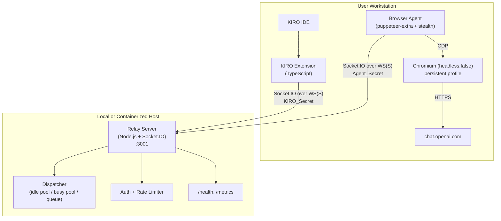
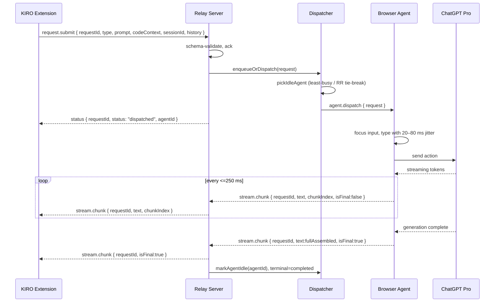
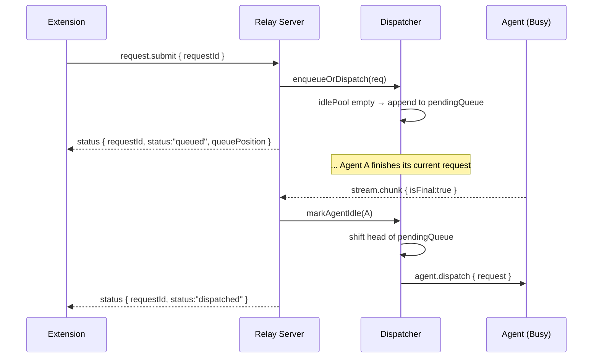
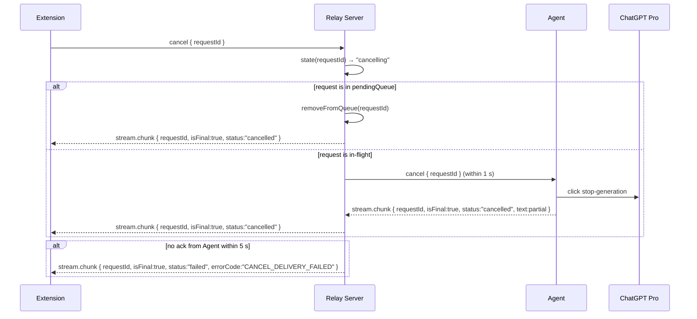
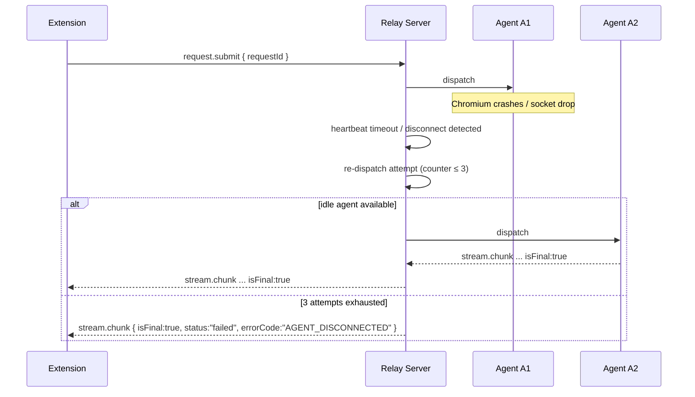
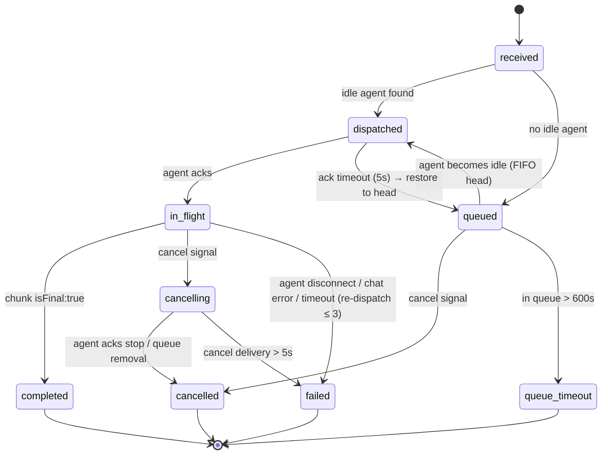
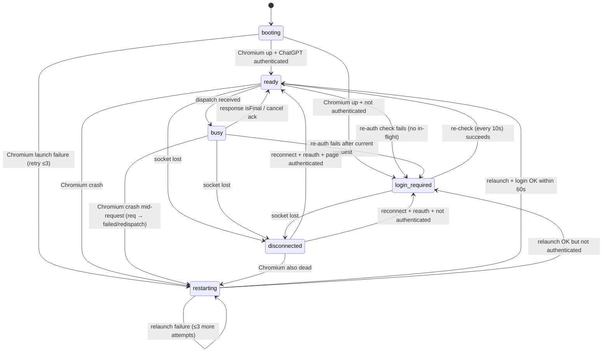
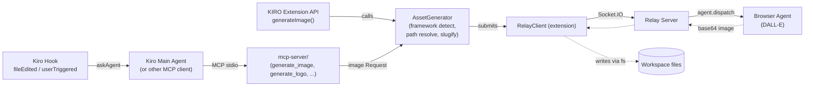
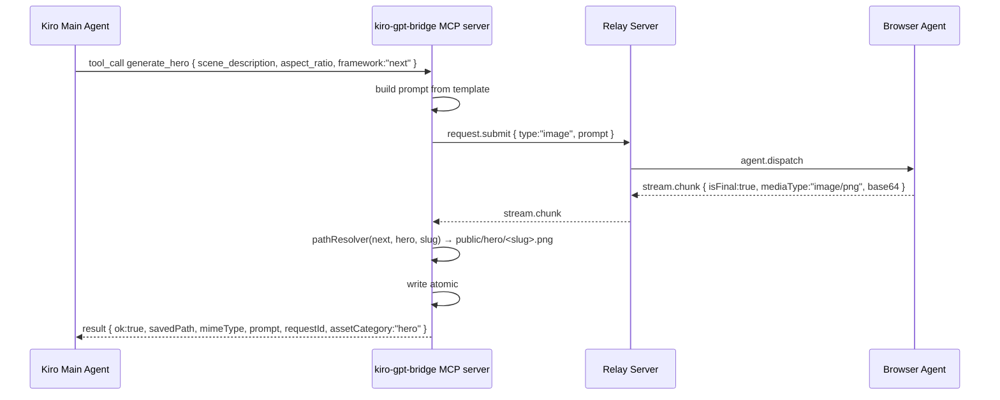
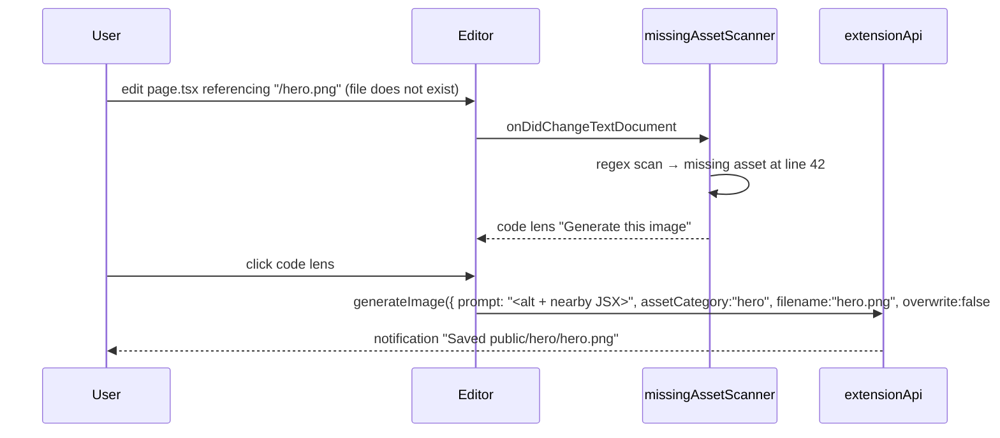

# Design Document

## Overview

The KIRO-GPT Bridge is a three-component system that exposes ChatGPT Pro and DALL-E inside the KIRO IDE without using the official OpenAI API. The components are:

1. **KIRO Extension** (`kiro-extension/`): TypeScript VS Code-style extension. Hosts the sidebar webview "ChatGPT Bridge", registers code-aware commands, manages local Sessions, and speaks Socket.IO to the Relay Server.
2. **Relay Server** (`relay-server/`): Node.js + TypeScript Express + Socket.IO process. Authenticates clients and agents with shared secrets, dispatches Requests to idle Agents, queues when all are busy, enforces correctness invariants (no-loss, FIFO, mutual exclusion), and exposes `/health` and `/metrics`.
3. **Browser Agent** (`browser-agent/`): Node.js + TypeScript process running puppeteer-extra with stealth. Drives a real, non-headless Chromium against ChatGPT Pro using a persistent profile, handles chat and image (DALL-E) requests, streams response chunks back, manages reconnection and login_required pauses.

A fourth folder, `shared/`, holds the on-the-wire schema (TypeScript types, Zod validators, JSON Schema) and is consumed by all three components to guarantee a single source of truth for messages, status events, and error codes.

The Relay Server is the only component on the network. KIRO Extensions and Browser Agents both connect outbound to the Relay Server. There is no direct extension ↔ agent connection.

### Design Goals

- **No-loss correctness**: every acknowledged Request terminates in exactly one of `completed`, `cancelled`, `failed`, `queue-timeout`.
- **Strict FIFO under load**: when all Agents are busy, Requests dispatch in arrival order.
- **Mutual exclusion**: one Request → one Agent at a time; one Agent → one Request at a time.
- **Resilient transport**: extension and agent both reconnect with bounded exponential backoff (1s → 30s).
- **Lean operational surface**: shared-secret auth + optional TLS + brute-force lockout, structured JSON logs, Prometheus metrics, `/health` JSON.
- **Schema-stable wire format**: a documented JSON schema with a deterministic pretty printer that round-trips byte-for-byte.

### Out of Scope

Explicit non-goals from Requirement 28 govern the design: no replacement of KIRO native AI, no use of the OpenAI API, no third-party telemetry, no persistence of prompts/responses except through explicit "Save as file" / "Save to workspace" actions.

---

## Architecture

### Component Diagram



### Top-Level Sequence: Idle-Agent Dispatch (happy path)



### Sequence: All-Busy Queueing Path



### Sequence: Cancel In-Flight



### Sequence: login_required → ready

```mermaid
sequenceDiagram
  participant A as Agent
  participant R as Relay Server
  participant E as Extension
  A->>A: detect login redirect / 401 page
  A-->>R: status { agentId, status:"login_required" }
  R->>R: mark agent unavailable; if all agents login_required → broadcast
  R-->>E: status { type:"agents", status:"login_required" }
  Note over A: User logs in manually in Chromium window
  A->>A: re-check every 10s detects authenticated DOM
  A-->>R: status { agentId, status:"ready" }
  R->>R: requeue dispatch loop, drain pendingQueue (FIFO)
  R-->>E: status { type:"agents", status:"ready", agentsReady:1 }
```

### Sequence: Agent Failure Mid-Request and Re-dispatch



### Request Lifecycle (state diagram)



### Browser Agent State Diagram



---

## Components and Interfaces

### Project Structure

```
kiro-gpt-bridge/
├── docker-compose.yml
├── package.json                    (workspace root, npm workspaces)
├── shared/
│   ├── package.json
│   ├── src/
│   │   ├── schema.ts               (TypeScript types: Request, Response, etc.)
│   │   ├── validate.ts             (Zod validators / JSON Schema)
│   │   ├── prettyPrint.ts          (deterministic 2-space indent printer)
│   │   ├── errors.ts               (ErrorCode enum)
│   │   └── events.ts               (Socket.IO event names)
├── relay-server/
│   ├── package.json
│   ├── Dockerfile
│   ├── src/
│   │   ├── index.ts                (boot, sigterm, port binding)
│   │   ├── config.ts               (env var parsing/validation)
│   │   ├── server.ts               (Express + Socket.IO setup, TLS)
│   │   ├── auth/
│   │   │   ├── secret.ts           (constant-time compare, 16–256 char rule)
│   │   │   └── rateLimiter.ts      (IP brute-force tracker: 5/60s → 300s)
│   │   ├── dispatch/
│   │   │   ├── dispatcher.ts       (idlePool, busyMap, queue, algorithm)
│   │   │   ├── agentPool.ts        (idle/busy/login_required/disconnected sets)
│   │   │   ├── pendingQueue.ts     (FIFO with timeout reaper)
│   │   │   └── leastBusy.ts        (60s window selector + RR tie-break)
│   │   ├── tracking/
│   │   │   └── requestTable.ts     (Map<RequestId, RequestState>)
│   │   ├── routes/
│   │   │   ├── health.ts           (/health JSON)
│   │   │   └── metrics.ts          (/metrics Prometheus text)
│   │   ├── log/
│   │   │   └── logger.ts           (pino, structured JSON, log_failures counter)
│   │   └── socket/
│   │       ├── clientHandlers.ts   (KIRO Extension events)
│   │       └── agentHandlers.ts    (Browser Agent events)
├── browser-agent/
│   ├── package.json
│   ├── src/
│   │   ├── index.ts                (boot)
│   │   ├── config.ts               (AGENT_PROFILE_DIR, RELAY_URL, AGENT_SECRET)
│   │   ├── socket/
│   │   │   └── relayClient.ts      (reconnect 1s→30s, reauth, status emit)
│   │   ├── browser/
│   │   │   ├── chromium.ts         (puppeteer-extra launch, persistent profile)
│   │   │   ├── selectors.ts        (CSS / role selectors w/ fallbacks)
│   │   │   ├── chatDriver.ts       (focus → type w/ 20–80ms jitter → submit)
│   │   │   ├── streamExtractor.ts  (MutationObserver-driven incremental text)
│   │   │   ├── imageDriver.ts      (DALL-E prompt + image extraction)
│   │   │   ├── stopAction.ts       (cancel: click stop button)
│   │   │   └── authDetector.ts     (login_required detection, every 10s)
│   │   ├── state/
│   │   │   └── machine.ts          (booting/ready/busy/login_required/restarting)
│   │   └── log/
│   │       └── logger.ts
├── kiro-extension/
│   ├── package.json
│   ├── src/
│   │   ├── extension.ts            (activate/deactivate)
│   │   ├── relay/
│   │   │   ├── relayClient.ts      (Socket.IO, reconnect 1s→30s, re-emit)
│   │   │   └── inflight.ts         (Map<RequestId, RequestRecord>)
│   │   ├── commands/
│   │   │   ├── openPanel.ts
│   │   │   ├── codeAwareCommands.ts (explain/refactor/tests/document/findBugs/optimize)
│   │   │   └── generateImage.ts
│   │   ├── webview/
│   │   │   ├── panelProvider.ts    (WebviewViewProvider for sidebar)
│   │   │   ├── messageBridge.ts    (extension ↔ webview JSON protocol)
│   │   │   └── ui/                 (HTML, JS, CSS for panel)
│   │   ├── sessions/
│   │   │   ├── store.ts            (per-session JSON files, atomic write+retry)
│   │   │   └── session.ts
│   │   ├── codeContext/
│   │   │   ├── resolver.ts         (#File / #Folder expansion)
│   │   │   └── truncator.ts        (200 KB cap with notice)
│   │   ├── status/
│   │   │   └── statusBar.ts
│   │   └── files/
│   │       ├── saveMarkdown.ts
│   │       └── saveImage.ts
└── README.md
```

### Relay Server: Module Boundaries

#### `config.ts`
Reads and validates environment:
- `PORT` (int 1–65535, default 3001) — invalid → log + exit non-zero (R1.2).
- `KIRO_SECRET`, `AGENT_SECRET` (16–256 chars) — invalid → log + exit (R2.5).
- `RELAY_TLS_ENABLED` ∈ {"true","false"}; if true requires `RELAY_TLS_CERT`/`RELAY_TLS_KEY` readable PEM (R2.4).
- `QUEUE_MAX_DEPTH` (100–100000, default 1000) (R6.5).

#### `server.ts`
- Express app with `/health` and `/metrics`.
- Socket.IO with `maxHttpBufferSize = 100 * 1024 * 1024` (R1.3) and `pingInterval`/`pingTimeout` tuned so heartbeat (15±2s) is independent.
- TLS via `https.createServer(...)` when enabled.
- SIGTERM/SIGINT handler: `server.close()`, drain in-flight up to 30 s, then send `SHUTDOWN` failure to remaining clients (R1.5–R1.6).

#### `auth/secret.ts`
Constant-time comparison (`crypto.timingSafeEqual`) over equal-length buffers. Returns boolean.

#### `auth/rateLimiter.ts`
In-memory map keyed by source IP:
```ts
type IpRecord = { failures: number[]; lockedUntil: number | null };
```
- On failure, push `Date.now()` and prune entries older than 60 s.
- If `failures.length >= 5`, set `lockedUntil = now + 300_000` (R2.6).
- On connect, if `lockedUntil > now`, reject immediately and log.

#### `dispatch/agentPool.ts`
Maintains four sets:
- `idle: Map<AgentId, AgentState>`
- `busy: Map<AgentId, { request: RequestId, dispatchedAt: number }>`
- `loginRequired: Set<AgentId>`
- `disconnected: Set<AgentId>` (transient, used during cleanup)

Maintains the per-agent recent-completion sliding window for the least-busy selection:
```ts
type AgentState = {
  agentId: AgentId;
  socketId: string;
  registeredAt: number;
  lastHeartbeatAt: number;
  recentDispatches: number[];        // ms timestamps within last 60s
  lastCompletionAt: number | null;   // for RR tie-break
};
```

Heartbeat watcher is a single `setInterval(1000)` that scans `idle ∪ busy` and moves any agent whose `lastHeartbeatAt < now - 45_000` to disconnected (R3.3).

#### `dispatch/leastBusy.ts`
```ts
function pickIdleAgent(idle: AgentState[]): AgentState | null {
  if (idle.length === 0) return null;
  const now = Date.now();
  for (const a of idle) {
    a.recentDispatches = a.recentDispatches.filter(t => t > now - 60_000);
  }
  // primary key: ascending recentDispatches.length
  // secondary key: ascending lastCompletionAt (null treated as 0 = "oldest")
  idle.sort((a, b) => {
    if (a.recentDispatches.length !== b.recentDispatches.length)
      return a.recentDispatches.length - b.recentDispatches.length;
    const la = a.lastCompletionAt ?? 0;
    const lb = b.lastCompletionAt ?? 0;
    return la - lb;
  });
  return idle[0];
}
```

This implements R5.2 exactly: load = count of dispatches in last 60 s; ties broken by oldest completion timestamp (no completion → treated as oldest possible).

#### `dispatch/pendingQueue.ts`
A doubly-linked list with O(1) head/tail and an aux `Map<RequestId, Node>` for O(1) cancel-by-id and reconnect-dedup lookups.

```ts
type QueueNode = {
  request: Request;
  enqueuedAt: number;
  prev: QueueNode | null;
  next: QueueNode | null;
};
```

A reaper runs every 1 s and pops nodes whose `enqueuedAt < now - 600_000`, transitioning them to `queue-timeout` (R6.7, R7.7, R27.8).

#### `dispatch/dispatcher.ts`
Main API surface:

```ts
interface Dispatcher {
  registerAgent(s: AgentState): void;
  removeAgent(agentId: AgentId): Request[]; // returns in-flight requests for re-dispatch
  markAgentLoginRequired(agentId: AgentId): void;
  markAgentReady(agentId: AgentId): void;
  onAgentHeartbeat(agentId: AgentId): void;

  submit(req: Request): Promise<void>;       // ack-or-throw
  cancel(requestId: RequestId, by: ClientId): CancelResult;
  onAgentAck(requestId: RequestId): void;
  onAgentChunk(chunk: StreamChunk): void;
  onAgentTerminal(requestId: RequestId, status: TerminalStatus): void;

  agentCount(): number;
  queueDepth(): number;
}
```

The submit algorithm enforces R5/R6/R7 ordering:

```ts
async submit(req: Request) {
  this.requestTable.set(req.requestId, { ...req, state: "received" });
  const idle = this.agentPool.idle();
  if (idle.length > 0) {
    const a = leastBusy(idle);
    return this.tryDispatch(req, a, /*retries*/0);
  }
  this.pendingQueue.append(req);
  this.requestTable.update(req.requestId, { state: "queued" });
  this.emitStatus(req, "queued", { queuePosition: this.pendingQueue.size() });
}

async tryDispatch(req: Request, a: AgentState, retries: number) {
  this.agentPool.markBusy(a.agentId, req.requestId);
  this.requestTable.update(req.requestId, { state: "dispatched", agentId: a.agentId });
  const ackTimeout = setTimeout(() => this.handleAckTimeout(req, a), 5000);
  try {
    await this.transport.dispatchToAgent(a, req);                    // (R5.1: <100 ms)
    this.emitStatus(req, "dispatched", { agentId: a.agentId });      // (R5.5: <200 ms)
  } catch (e) {
    clearTimeout(ackTimeout);
    if (retries < 3) {
      const next = leastBusy(this.agentPool.idle().filter(x => x.agentId !== a.agentId));
      if (next) {
        this.emitStatus(req, "dispatch_retrying", { retryCount: retries + 1 });
        return this.tryDispatch(req, next, retries + 1);
      }
    }
    this.pendingQueue.append(req);
    this.requestTable.update(req.requestId, { state: "queued" });
    this.emitStatus(req, "queued_after_dispatch_failure");
  }
}
```

The drain loop runs whenever an agent transitions to idle:

```ts
function onAgentIdle(a: AgentState) {
  // FIFO drain
  while (this.pendingQueue.size() > 0) {
    const idle = this.agentPool.idle();
    if (idle.length === 0) break;
    const head = this.pendingQueue.popHead();
    const target = leastBusy(idle);
    this.tryDispatch(head, target, 0);
  }
}
```

This guarantees R6.3 (head-of-queue is always next) and R7.3 (FIFO across simultaneous transitions: even if multiple agents become idle, we pop from the head before each dispatch).

#### `tracking/requestTable.ts`
Single source of truth for request state:

```ts
type RequestRecord = {
  request: Request;
  state: "received" | "queued" | "dispatched" | "in_flight"
       | "cancelling" | "completed" | "cancelled" | "failed" | "queue_timeout";
  agentId: AgentId | null;
  clientId: ClientId;
  receivedAt: number;
  enqueuedAt: number | null;
  dispatchedAt: number | null;
  redispatchCount: number;     // ≤ 3 (R7.8)
};
```

Every state transition is performed through a single `transition(requestId, next)` method that asserts the source state is in the legal predecessor set; this is where the Request lifecycle invariant lives in code.

#### `routes/health.ts`
```json
{
  "status": "ok",
  "uptimeSeconds": 12345,
  "registeredAgents": 2,
  "registeredClients": 7,
  "queueDepth": 4
}
```

#### `routes/metrics.ts`
Prometheus text:
- `requests_total` (counter, labels: `type`, `terminal`)
- `requests_failed_total` (counter, label: `errorCode`)
- `queue_depth` (gauge)
- `agents_connected` (gauge)
- `request_duration_seconds` (histogram, default Prom buckets)
- `log_failures_total` (counter)

### Browser Agent: Module Boundaries

#### `socket/relayClient.ts`
Uses `socket.io-client` with custom backoff (1s, 2s, 4s, 8s, 16s, 30s, 30s, …). On connect, sends handshake auth `{ agentSecret }`. On `connect_error` with reason `auth`, increments backoff and retries (R11.6).

Public API:
```ts
emitStatus(status: AgentStatus, extra?: object): void;
emitChunk(chunk: StreamChunk): void;
emitFailure(requestId: RequestId, errorCode: ErrorCode, message?: string): void;
on(event: "dispatch", h: (req: Request) => void): void;
on(event: "cancel", h: (req: { requestId: RequestId }) => void): void;
```

#### `browser/chromium.ts`
```ts
const browser = await puppeteer.launch({
  headless: false,                                         // R8.2
  userDataDir: config.AGENT_PROFILE_DIR,                   // R8.3, R8.4
  args: ["--no-sandbox", "--disable-blink-features=AutomationControlled"],
  defaultViewport: null,
});
```
Wrapped in a 3-attempt × 5 s retry loop with a 30 s overall budget (R8.1, R8.5).

`browser.on("disconnected", ...)` triggers state machine transition to `restarting` and a relaunch attempt within 30 s (R11.4, R11.7).

#### `browser/chatDriver.ts`
1. `await page.goto("https://chat.openai.com")` (idempotent; checked first).
2. `const input = await waitForSelector(page, SEL.INPUT, { timeout: 5000 })` (R9.7 → INPUT_UNAVAILABLE).
3. `await input.click({ clickCount: 3 }); await input.press("Backspace");` (clear).
4. Type loop:
   ```ts
   for (const ch of prompt) {
     await page.keyboard.type(ch);
     await sleep(20 + Math.random() * 60);   // 20–80ms uniform (R9.2)
   }
   ```
5. `await page.click(SEL.SEND)` within 500 ms of finishing typing (R9.3).
6. Stream extractor activates.

#### `browser/streamExtractor.ts`
Uses `page.evaluateOnNewDocument` to install a `MutationObserver` on the assistant message container that posts the *current full innerText* via `window._kiroChunkBus(text, isFinal)`. The Node side debounces these into chunks emitted at most every 250 ms (R9.4), computing diff-suffix as the new chunk text and tracking `chunkIndex`. When the extractor sees the "stop" button transition to "regenerate" (or the `data-message-finished` attribute appear), it emits `{ isFinal: true, text: fullAssembled }` within 500 ms (R9.5). A 120 s deadline timer triggers `CHAT_TIMEOUT` if no chunks have been observed (R9.8).

#### `browser/imageDriver.ts`
1. Validate prompt length 1–4000 chars and not all whitespace; otherwise emit `INVALID_PROMPT` immediately without sending anything (R10.7).
2. Submit the prompt with a DALL-E directive prefix.
3. Poll the response container for `` elements.
4. Once an `` appears, `fetch(src)` from inside the page context (`page.evaluate`) and read as `arrayBuffer`, returning `{ mimeType, base64 }`.
5. Emit Response with `mediaType` and `isFinal: true` (R10.4).
6. 180 s deadline → `IMAGE_TIMEOUT` (R10.5); refusal text → `CONTENT_POLICY` (R10.6); navigation/load failure → `CHATGPT_UNAVAILABLE` (R10.8).

#### `browser/stopAction.ts`
Click the visible "Stop generating" button if present; otherwise send `Escape`. Must complete within 2 s of receiving the cancel signal (R20.4).

#### `browser/authDetector.ts`
Periodic check (every 10 s while paused, plus a probe before each Request):
- `login_required` if `page.url()` contains `/auth/login` or DOM contains the "Log in" landing button.
- `ready` if the chat composer selector is present.

#### `state/machine.ts`
A typed FSM with the transitions in the state diagram above; rejects illegal transitions and logs them.

### KIRO Extension: Module Boundaries

#### `extension.ts`
- `activate(ctx)`:
  - Read user setting `kiroGptBridge.relayUrl` (R4.1, R4.2).
  - Construct `RelayClient` with reconnect policy (R21.1).
  - Register all commands (R12, R13).
  - Register `WebviewViewProvider` for the sidebar panel `kiroGptBridge.panel` titled "ChatGPT Bridge" (R12.1).
  - Register status bar item (R12.8, R22).

#### `relay/relayClient.ts`
Wraps `socket.io-client` with backoff 1s → 30s (R21.1). Holds an `inflight: Map<RequestId, RequestRecord>` of all non-terminal requests; on reconnect, re-emits them (R21.3). The relay deduplicates by `requestId` (R21.4).

```ts
type RequestRecord = {
  request: Request;
  state: "submitting" | "queued" | "dispatched" | "streaming" | "cancelling";
  receivedChunks: string[];
  lastChunkAt: number;
};
```

A 30 s `lastChunkAt` watchdog flips a record into "stream-interrupted" (R16.6).

#### `webview/panelProvider.ts`
- One `WebviewView` for the sidebar "ChatGPT Bridge".
- Persists state to `ctx.globalState` (mode toggle, last session id).
- Posts/receives JSON messages over `webview.postMessage` / `onDidReceiveMessage`.

Webview ↔ extension protocol (host = extension, guest = webview):

```ts
type WebviewToHost =
  | { kind: "submit"; sessionId: string; mode: "chat" | "image"; text: string;
      attachments: Attachment[]; codeContextTokens: string[] }
  | { kind: "cancel"; requestId: string }
  | { kind: "newSession" }
  | { kind: "deleteSession"; sessionId: string; confirmed: boolean }
  | { kind: "saveMarkdown"; messageId: string; defaultName: string }
  | { kind: "saveImage"; messageId: string; defaultName: string }
  | { kind: "copyCode"; code: string }
  | { kind: "insertCode"; code: string };

type HostToWebview =
  | { kind: "status"; panelStatus: PanelStatus; agents: number; queue: number }
  | { kind: "session.created"; sessionId: string }
  | { kind: "session.loaded"; session: Session }
  | { kind: "request.queued"; requestId: string; queuePosition: number }
  | { kind: "request.dispatched"; requestId: string; agentId: string }
  | { kind: "stream.chunk"; requestId: string; text: string; chunkIndex: number; isFinal: boolean; mediaType?: string }
  | { kind: "stream.interrupted"; requestId: string }
  | { kind: "request.terminal"; requestId: string; terminal: "completed"|"cancelled"|"failed"|"queue_timeout"; errorCode?: string; message?: string }
  | { kind: "error"; message: string };
```

#### `sessions/store.ts`
One JSON file per session: `<globalStorage>/sessions/<sessionId>.json` (R15.1). Atomic write = write to `<sessionId>.json.tmp`, fsync, rename. On failure, retain in memory and retry next message (R15.8).

```ts
type Session = {
  sessionId: string;
  createdAt: number;
  updatedAt: number;
  messages: Array<{ id: string; role: "user" | "assistant"; text?: string;
                    mediaType?: string; createdAt: number }>;
};
```

The session history attached to a Request is computed by `take last N` where N is `kiroGptBridge.sessionHistoryMax` (1–200, default 50, clamped) (R15.4).

#### `codeContext/resolver.ts`
Given a prompt with `#File:<path>` and `#Folder:<path>` tokens:

```ts
function resolve(text: string, workspaceRoot: string): ResolveResult {
  const errors: ResolveError[] = [];
  const expanded = text.replace(TOKEN_RE, (raw, kind, rel) => {
    const abs = path.resolve(workspaceRoot, rel);
    if (!isInside(workspaceRoot, abs)) { errors.push({ token: raw, reason: "outside_workspace" }); return raw; }
    if (kind === "File") {
      if (!fs.existsSync(abs)) { errors.push({ token: raw, reason: "not_found" }); return raw; }
      const stat = fs.statSync(abs);
      if (stat.size > 200 * 1024) { errors.push({ token: raw, reason: "file_too_large" }); return raw; }
      return "```\n" + fs.readFileSync(abs, "utf8") + "\n```";
    } else { // Folder
      if (!fs.existsSync(abs)) { errors.push({ token: raw, reason: "not_found" }); return raw; }
      const list = walk(abs, { maxFiles: 1000 });
      if (list === "exceeded") { errors.push({ token: raw, reason: "folder_too_many_files" }); return raw; }
      return list.join("\n");
    }
  });
  return { text: expanded, errors };
}
```

If `errors.length > 0` the request is not sent and a panel error message is shown identifying each offending token (R14.3).

#### `codeContext/truncator.ts`
After expansion, if the assembled Code_Context exceeds 200 KB, truncate to 200 KB and append a notice `"\n\n[Code context truncated from <originalKB> KB to 200 KB]"` (R14.4).

#### `status/statusBar.ts`
A single VS Code `StatusBarItem`. Receives status events and renders one of: `"disconnected"`, `"connected"`, `"streaming"`, `"queued: N"`, `"agents: M"` (R12.8). Uses a 5 s staleness watchdog: if no status event has been received for >5 s, force `"disconnected"` (R22.5).

#### `files/saveMarkdown.ts` / `files/saveImage.ts`
- Use `vscode.window.showInputBox` for filename, `vscode.window.showSaveDialog` for path under workspace root.
- Validate filename: reject characters invalid for the host filesystem (Windows: `<>:"/\\|?*` and reserved names; POSIX: `/` and NUL); on invalid, re-prompt (R17.6, R19.1).
- Overwrite confirmation; on user dismissal without choosing, append `_YYYYMMDD-HHMMSS` to the basename and write to that uniquely-named file (R19.4).
- All writes are atomic (write to `.tmp` then rename) to satisfy R19.6 (no partial files).

---

## Data Models

### Wire schema (`shared/src/schema.ts`)

```ts
// ─── primitives ───
export type RequestId  = string;   // UUID v4, 36 chars
export type ClientId   = string;   // 16–64 chars, server-issued
export type AgentId    = string;   // server-issued, fresh on every (re)connect
export type SessionId  = string;   // UUID v4 from extension

// ─── enums ───
export const REQUEST_TYPES = ["chat", "image"] as const;
export type RequestType = typeof REQUEST_TYPES[number];

export const TERMINAL_STATUSES = ["completed", "cancelled", "failed", "queue_timeout"] as const;
export type TerminalStatus = typeof TERMINAL_STATUSES[number];

export const ERROR_CODES = [
  "PAYLOAD_TOO_LARGE", "SCHEMA_INVALID", "MALFORMED_INPUT", "MESSAGE_TOO_LARGE",
  "QUEUE_FULL", "QUEUE_TIMEOUT",
  "AGENT_DISCONNECTED", "CHATGPT_ERROR", "CHATGPT_UNAVAILABLE",
  "INPUT_UNAVAILABLE", "CHAT_TIMEOUT",
  "IMAGE_TIMEOUT", "CONTENT_POLICY", "INVALID_PROMPT",
  "CANCEL_DELIVERY_FAILED", "SHUTDOWN", "AUTH_FAILED", "CAPACITY_EXCEEDED",
] as const;
export type ErrorCode = typeof ERROR_CODES[number];

// ─── Code_Context ───
export interface CodeContext {
  selection?: string;             // 0–100000 chars
  filePath?: string;              // absolute path (workspace-resolved)
  language?: string;              // e.g., "typescript"
  fileContent?: string;           // ≤ 200000 chars (no selection case)
  expandedTokens?: ExpandedToken[];
  truncated?: { originalSizeBytes: number; truncatedToBytes: number };
}

export interface ExpandedToken {
  token: string;                  // "#File:src/foo.ts" or "#Folder:src"
  kind: "File" | "Folder";
  bytes: number;
}

// ─── Attachment ───
export interface Attachment {
  filename: string;               // original
  mimeType: string;               // image/* or application/pdf, text/plain, etc.
  base64: string;                 // ≤ 25 MB after decode
}

// ─── History entry ───
export interface HistoryMessage {
  role: "user" | "assistant";
  text: string;
  createdAt: number;              // epoch ms
}

// ─── Request ───
export interface Request {
  protocolVersion: 1;
  requestId: RequestId;
  clientId: ClientId;             // assigned by relay; echoed by extension
  sessionId: SessionId;
  type: RequestType;
  prompt: string;                 // chat: 1–32000; image: 1–4000
  codeContext?: CodeContext;
  history?: HistoryMessage[];     // 0–200 entries
  attachments?: Attachment[];     // each ≤ 25 MB
  submittedAt: number;            // epoch ms
}

// ─── Stream chunk ───
export interface StreamChunk {
  protocolVersion: 1;
  requestId: RequestId;
  chunkIndex: number;             // 0-based, monotonically increasing per request
  text: string;                   // chat only; "" if isFinal & image
  isFinal: boolean;
  mediaType?: "image/png" | "image/jpeg" | "image/webp" | "image/gif";
  base64?: string;                // image: ≤ 25 MB after decode
  // when isFinal:true and terminal!="completed":
  status?: TerminalStatus;        // "cancelled" | "failed"
  errorCode?: ErrorCode;
  message?: string;
}

// ─── Cancel signal ───
export interface CancelSignal {
  protocolVersion: 1;
  requestId: RequestId;
}

// ─── Status events ───
export type RequestStatus =
  | "received" | "dispatched" | "queued" | "queued_after_dispatch_failure"
  | "dispatch_retrying" | "redispatching" | "streaming"
  | "cancelling" | "cancelled";
export type AgentStatus = "ready" | "busy" | "login_required" | "restarting" | "disconnected";

export interface RequestStatusEvent {
  protocolVersion: 1;
  kind: "request_status";
  requestId: RequestId;
  status: RequestStatus;
  agentId?: AgentId;
  queuePosition?: number;
  retryCount?: number;
}

export interface AgentStatusEvent {
  protocolVersion: 1;
  kind: "agent_status";
  agentId: AgentId;
  status: AgentStatus;
  message?: string;
}

export interface ServerStatusEvent {
  protocolVersion: 1;
  kind: "server_status";
  registeredAgents: number;
  agentsReady: number;            // !login_required
  queueDepth: number;
  loginRequiredAll: boolean;
}

// ─── Heartbeats ───
export interface AgentHeartbeat {
  protocolVersion: 1;
  agentId: AgentId;
  emittedAt: number;
}

// ─── Auth handshake ───
export interface ClientHandshake { kiroSecret: string; clientVersion: string; }
export interface AgentHandshake  { agentSecret: string; agentVersion: string; capabilities: { chat: true; image: true }; }
```

### Socket.IO Event Names (`shared/src/events.ts`)

```ts
export const EV = {
  // KIRO Extension ↔ Relay
  REQUEST_SUBMIT:    "request.submit",
  REQUEST_CANCEL:    "request.cancel",
  REQUEST_STATUS:    "request.status",
  STREAM_CHUNK:      "stream.chunk",
  AGENT_STATUS:      "agent.status",       // broadcast
  SERVER_STATUS:     "server.status",      // broadcast

  // Browser Agent ↔ Relay
  AGENT_REGISTER:    "agent.register",     // implicit on auth
  AGENT_HEARTBEAT:   "agent.heartbeat",
  AGENT_DISPATCH:    "agent.dispatch",     // server → agent
  AGENT_CANCEL:      "agent.cancel",       // server → agent
  AGENT_ACK:         "agent.ack",
  AGENT_STATUS_FROM: "agent.status_from",  // agent → server (login_required, ready, restarting)
} as const;
```

### Pretty Printer (`shared/src/prettyPrint.ts`)

```ts
const FIELD_ORDER: Record<string, string[]> = {
  Request: ["protocolVersion","requestId","clientId","sessionId","type","prompt",
            "codeContext","history","attachments","submittedAt"],
  StreamChunk: ["protocolVersion","requestId","chunkIndex","text","isFinal",
                "mediaType","base64","status","errorCode","message"],
  CodeContext: ["selection","filePath","language","fileContent","expandedTokens","truncated"],
  // ...
};
```

The pretty printer:
1. Walks the object tree.
2. At each object level, emits keys in `FIELD_ORDER[<typeTag>]` order; unknown keys are sorted lexicographically and appended.
3. Indents at 2 spaces.
4. UTF-8 output, no trailing newline.

This makes `prettyPrint(x)` byte-equal for any two semantically-equal `x`'s (R26.2) and round-trip safe (R26.3, R26.4).

### Relay Server `/health` Shape

```json
{
  "status": "ok",
  "uptimeSeconds": 1234,
  "registeredAgents": 2,
  "registeredClients": 7,
  "queueDepth": 3
}
```

`status` is `"ok"` while `registeredAgents > 0 && !allAgentsLoginRequired`, otherwise `"degraded"`.

### Persistence: Session File Format

Path: `<extensionGlobalStoragePath>/sessions/<sessionId>.json`. Content is the `Session` interface above, serialized through the same deterministic pretty printer used on the wire (so file diffs are stable in version control if a user opts to track them).

Atomic write algorithm (`sessions/store.ts`):
```ts
async function writeAtomic(path: string, data: string) {
  const tmp = `${path}.tmp-${Date.now()}-${Math.random().toString(36).slice(2)}`;
  await fs.writeFile(tmp, data, { encoding: "utf8" });
  await fs.fsync(await fs.open(tmp, "r"));     // pseudocode
  await fs.rename(tmp, path);
}
async function persistSession(session: Session) {
  for (let attempt = 1; attempt <= 3; attempt++) {
    try { await writeAtomic(filePathFor(session), prettyPrint(session)); return; }
    catch (e) { if (attempt === 3) throw e; await sleep(200 * attempt); }
  }
}
```
On hard failure, the session stays in memory and a non-blocking notification is shown; the next message addition retries (R15.8).

### Security Model: Data Structures

- `IpRecord` map (in-memory, no eviction beyond a periodic prune for entries with empty `failures` and no active lockout).
- Secrets compared via `crypto.timingSafeEqual` over equal-length buffers; mismatched lengths short-circuit to `false` *after* a constant-time pad to avoid length-leak.
- Optional TLS via `https.createServer({ cert, key })`. Cert/key paths read once at boot; rotation requires restart (acceptable per R2.4 wording).


---

## Correctness Properties

*A property is a characteristic or behavior that should hold true across all valid executions of a system — essentially, a formal statement about what the software should do. Properties serve as the bridge between human-readable specifications and machine-verifiable correctness guarantees.*

The properties below were derived from the prework analysis and consolidated to remove redundancy. Each property is a universal statement and identifies the requirements it validates. Property-based tests for each are described in the Testing Strategy section.

### Property 1: No-loss (every acknowledged request reaches a terminal state)

*For all* sequences of Request submissions, Cancel signals, Agent registrations, Agent disconnects, Agent ack timeouts, Chromium crashes, Client disconnects, and clock advances, every Request acknowledged by the Relay Server eventually transitions to exactly one of the terminal states `completed`, `cancelled`, `failed`, or `queue_timeout`, and never silently disappears.

**Validates: Requirements 3.4, 4.5, 5.6, 5.7, 6.8, 7.2, 7.6, 7.8, 20.7, 23.3, 27.1**

### Property 2: FIFO under all-busy

*For all* sequences in which all currently registered Agents are busy at the moment a set of Requests R₁, R₂, …, Rₙ is submitted (in that arrival order), and for all subsequent sequences of Agent-becomes-idle events (including events where multiple Agents become idle in the same tick), the Dispatcher forwards R₁, R₂, …, Rₙ to Agents in arrival order. Specifically: at any point during the drain, the Request popped from the head of the Pending Queue is the one with the smallest enqueue timestamp.

**Validates: Requirements 5.8, 6.3, 6.4, 7.3, 23.4, 23.5, 23.6, 27.2**

### Property 3: State consistency of the Agent pool

*For all* sequences of Agent registrations, disconnections, login_required transitions, dispatches, and completions, at every point in time the equality holds:

`|busyAgents| + |idleAgents| + |loginRequiredAgents| = |registeredAgents|`

and the four sets are pairwise disjoint, and `disconnectedAgents ∩ registeredAgents = ∅`.

**Validates: Requirements 3.1, 3.5, 5.3, 7.1, 27.3**

### Property 4: Request- and Agent-mutual exclusion + chunk routing

*For all* points in time during any execution, no Request is concurrently dispatched to more than one Agent, no Agent is concurrently assigned more than one Request, and every Stream Chunk emitted for a Request is routed to exactly the originating Client (and to no other Client).

**Validates: Requirements 7.4, 7.5, 27.6, 27.7**

### Property 5: Pretty-printer round-trip and determinism

*For all* valid `Request` and `StreamChunk` objects up to 25 MB serialized size — including those carrying `Attachment` arrays, base64-encoded image payloads, and `CodeContext` with expanded tokens — the following hold:

1. **Round-trip**: `parse(prettyPrint(x))` is structurally equal to `x` (every schema field equal, including byte-for-byte equal attachment bodies and decoded image bytes).
2. **Determinism**: For any pair `x, y` of structurally equal objects, `prettyPrint(x) === prettyPrint(y)` as a UTF-8 byte string.

**Validates: Requirements 26.1, 26.2, 26.3, 26.4, 27.4**

### Property 6: Stream consistency

*For all* Requests of type `chat`, the sequence of `StreamChunk` events emitted carries chunks `c₀, c₁, …, c_k` where `cₖ.isFinal === true` and `cₖ.text` equals the concatenation `c₀.text + c₁.text + … + c_{k-1}.text` (or, equivalently, the cumulative observed text of the response). Furthermore, for any execution in which more than 250 ms elapse between successive non-final chunks while the underlying response is still producing text, a chunk is emitted by the next 250 ms boundary; and if 120 s elapse with no observed chunk after submission, a final chunk is emitted with `isFinal === true`, `errorCode === "CHAT_TIMEOUT"`, and the request transitions to `failed`.

**Validates: Requirements 9.4, 9.5, 9.8, 16.1, 27.5**

### Property 7: Queue-timeout enforcement

*For all* executions, every Request whose time-in-queue exceeds 600,000 ms transitions to the `queue_timeout` terminal state and produces a final failure Response to its originating Client. Equivalently: at any point in time, no Request currently in the Pending Queue has `enqueuedAt < now - 600_000`.

**Validates: Requirements 6.7, 7.7, 27.8**

### Property 8: Reconnect backoff schedule

*For all* attempt counts `n ≥ 1` and all reconnect failure sequences, the next-attempt delay equals `min(1000 × 2^(n-1), 30_000)` ms. Equivalently: the delay sequence is non-decreasing, never exceeds 30,000 ms, and reaches 30,000 ms by attempt 6.

**Validates: Requirements 11.1, 21.1**

### Property 9: IP brute-force lockout

*For all* time-stamped sequences of authentication attempts from a single source IP, the lockout state of that IP at time `t` equals the result of the reference rate-limiter:

- The IP is `locked` at `t` iff there exists a time `t* ≤ t` at which the IP had ≥5 failures within the trailing 60-second window and `t < t* + 300_000`.
- An attempt at time `t` while `locked` is rejected without checking the secret.
- A successful attempt does not, by itself, clear lockout (the 300 s timer must elapse).

**Validates: Requirements 2.6**

### Property 10: Atomic write — no partial files; eventual persistence

*For all* sequences of session-write operations and injected I/O failures, two facts hold:

1. **Atomicity**: At any point in time, the target session file on disk is either absent or fully and correctly content-equal to a previous successful write — never half-written.
2. **Eventual persistence**: After any prefix of failed writes, once a write succeeds the on-disk content equals the in-memory session at that moment, and the in-memory session has retained every message added during the failure window.

**Validates: Requirements 15.8, 19.6**

### Property 11: Code-context resolution and truncation

*For all* user prompts containing zero or more `#File:<path>` and `#Folder:<path>` tokens and all workspace layouts:

- If every token resolves to a file inside the workspace root with size ≤ 200 KB (for `#File`), or to a folder with ≤ 1000 files (for `#Folder`), then `resolve(prompt)` returns a `text` in which every token has been replaced by the documented expansion (file contents in fenced block, or recursive listing), and `errors === []`.
- If any token violates the workspace-bound, file-not-found, file-size, or folder-count rule, then `errors` contains one entry per violating token (with token text and reason), and the Request is *not* sent.
- After expansion, if `byteLen(codeContext) > 200 × 1024`, the resolver truncates to exactly 200 × 1024 bytes and appends a notice naming the original size; otherwise no notice is appended.

**Validates: Requirements 14.1, 14.2, 14.3, 14.4**

### Property 12: Extension reconnection idempotence

*For all* sequences `(submit, …, disconnect, reconnect)` in which a set `S` of Requests was non-terminal at the moment of disconnect, the post-reconnect Relay state has every `r ∈ S` in exactly the same logical state it occupied before the disconnect (or in `failed/cancelled` if the relay tore them down), and every duplicate `request.submit` carrying a previously-seen `requestId` leaves the Relay's request table unchanged (idempotent dedup).

**Validates: Requirements 21.3, 21.4**

### Property 13: Status-bar label domain

*For all* sequences of Relay status events received by the KIRO Extension, the status-bar text at any point is exactly one of the documented strings `"disconnected"`, `"connected"`, `"streaming"`, `"queued: N"` (with N ∈ 0..9999), or `"agents: M"` (with M ∈ 0..999). Furthermore, if no status event has been received for more than 5 s, the text becomes `"disconnected"`. After a Cancel terminal event, the panel-header label remains `"Cancelled"` for at least 3 s before any other label is shown.

**Validates: Requirements 12.8, 22.1, 22.5, 22.6**

### Property 14: Session-history window

*For all* sessions with `k` recorded messages and all configured maxima `N ∈ [1, 200]`, the `history` field of an outgoing Request equals the last `min(k, N)` messages of the session in chronological order, and never includes any earlier message.

**Validates: Requirements 15.3, 15.4**

### Property 15: Image base64 round-trip

*For all* image byte buffers `b` of size up to 25 MB, `base64Decode(base64Encode(b)) === b` byte-for-byte, and the `mediaType` field reported on the wire equals the source MIME type.

**Validates: Requirements 10.3, 10.4, 26.4**

### Property 16: Keystroke jitter range

*For all* prompts of length 1..32000 characters typed by the Browser Agent, every inter-keystroke delay drawn lies in the closed range [20 ms, 80 ms]. (The empirical distribution is required to fall within a uniform-distribution acceptance band on a Kolmogorov-Smirnov check at α=0.01 in the test harness.)

**Validates: Requirements 9.2**

### Property 17: openPanel idempotence

*For all* sequences of `kiroGptBridge.openPanel` invocations, the count of registered "ChatGPT Bridge" panels is exactly 1 after the first invocation and remains exactly 1 for all subsequent invocations.

**Validates: Requirements 12.3**

### Property 18: Code-aware command CodeContext fields

*For all* invocations of any of the six code-aware commands with a non-empty active selection in an editor whose file path and language are known, the outgoing Request's `codeContext` contains a non-empty `selection`, a non-empty `filePath`, and a non-empty `language`.

**Validates: Requirements 13.3**

### Property 19: Fenced-code-block button count

*For all* rendered final Responses, the number of "Copy" buttons displayed equals the number of fenced code blocks in the response, and equals the number of "Insert at cursor" buttons displayed.

**Validates: Requirements 13.6**

---

## Error Handling

### Error Code Taxonomy

All on-the-wire errors use a closed `ErrorCode` enum (defined in `shared/src/errors.ts`):

| Code | Source | Trigger |
|------|--------|---------|
| `PAYLOAD_TOO_LARGE` | Relay | Socket.IO frame > 100 MB (R1.4) |
| `MESSAGE_TOO_LARGE` | Relay | Logical message > 25 MB (R26.6) |
| `MALFORMED_INPUT` | Relay | Not well-formed UTF-8 JSON (R26.6) |
| `SCHEMA_INVALID` | Relay | Schema validation fails; carries first failing field path (R26.5) |
| `QUEUE_FULL` | Relay | Queue at `QUEUE_MAX_DEPTH` (R6.6) |
| `QUEUE_TIMEOUT` | Relay | In-queue > 600 s (R6.7) |
| `CAPACITY_EXCEEDED` | Relay | > 50 concurrent clients (R4.7) |
| `AUTH_FAILED` | Relay | Bad/missing secret or rate-limited (R2.3, R2.6) |
| `SHUTDOWN` | Relay | In-flight aborted by SIGTERM/SIGINT (R1.6) |
| `AGENT_DISCONNECTED` | Relay | Agent vanished mid-request after 3 redispatches (R3.4, R7.8) |
| `CANCEL_DELIVERY_FAILED` | Relay | Cancel undeliverable in 5 s (R20.7) |
| `INPUT_UNAVAILABLE` | Agent | Cannot focus chat input in 5 s (R9.7) |
| `CHAT_TIMEOUT` | Agent | No chat chunks in 120 s (R9.8) |
| `IMAGE_TIMEOUT` | Agent | No image in 180 s (R10.5) |
| `INVALID_PROMPT` | Agent | Image prompt empty/whitespace/>4000 (R10.7) |
| `CONTENT_POLICY` | Agent | DALL-E refusal (R10.6) |
| `CHATGPT_ERROR` | Agent | Visible chat error in DOM (R9.6) |
| `CHATGPT_UNAVAILABLE` | Agent | Page unreachable / not loaded (R10.8) |

### Error Delivery Pattern

All errors flow back to the originating Client via the same `stream.chunk` channel as terminal events: `{ requestId, isFinal: true, status: "failed" | "cancelled" | "queue_timeout", errorCode, message? }`. This unification keeps the lifecycle model in Property 1 simple: the Client only ever observes one terminal frame per Request.

### Internal Failure Handling

- **Log sink failures** (R24.4): Logger calls are wrapped in `try/catch`. Failures increment `log_failures_total` (Prometheus) and never propagate. Request processing is unaffected.
- **Heartbeat parse failures** (R3.6): Discarded silently; the agent's `lastHeartbeatAt` is not updated; the disconnect timer continues to count down.
- **Schema validation failures** (R26.5): Reject within 500 ms with `SCHEMA_INVALID` and the first failing field path; no partial state retained.
- **TLS configuration failures** (R2.4): Detected at boot; relay logs and exits non-zero. There is no "degraded" TLS mode.

### Browser Agent Failure → Recovery Matrix

| Failure | State | Recovery |
|---|---|---|
| Socket disconnect | `disconnected` | Reconnect with 1s→30s exponential backoff (P8) |
| Reauth fails after socket reconnect | `disconnected` | Close socket, resume backoff (R11.6) |
| Chromium crash (no in-flight) | `restarting` | Relaunch within 30 s, ≤ 3 retries (R11.4, R11.7) |
| Chromium crash (in-flight) | `restarting` | Mark in-flight as failed (so relay can redispatch), then relaunch |
| Login expired (no in-flight) | `login_required` | Wait, re-check every 10 s (R8.8) |
| Login expired (in-flight) | finish current then `login_required` | (R8.7) |
| ChatGPT visible error | (Request → failed) | Emit `CHATGPT_ERROR` and stay `ready` |

---

## Testing Strategy

### Levels of Testing

1. **Unit tests** for pure functions (config parsers, secret validator, `leastBusy`, pretty printer, code-context resolver, base64 codec, filename validator, backoff scheduler).
2. **Property-based tests** (PBT) for all properties in §Correctness Properties.
3. **Integration tests** for socket transport, full dispatch path with mocked agents, save-to-disk, /health, /metrics.
4. **Smoke tests** for boot, Docker Compose, cross-platform Chromium launch.
5. **End-to-end tests** for one chat and one image request against ChatGPT Pro (manual / opt-in; not in CI by default to avoid hitting the live UI).

### Tooling

- **Test runner**: `vitest` for all three packages (single-execution; we will use `vitest --run` not watch).
- **PBT library**: [`fast-check`](https://github.com/dubzzz/fast-check) for TypeScript. We do not implement PBT from scratch.
- **Iterations**: every property test runs **at least 100 iterations** (`fc.assert(prop, { numRuns: 100 })`); flake-prone properties use 500.
- **Tagging**: every property test carries a leading comment of the exact form
  `// Feature: kiro-gpt-bridge, Property <N>: <property body>`
  so test ↔ design traceability is mechanical.

### Property → Test Encoding

Each master property below specifies the **model state**, **actions** the PBT generator can emit, and the **invariant** asserted after every action. We use `fast-check`'s `commands` API for stateful PBT.

#### P1 No-loss

- **Model state**: `Map<RequestId, "received"|"queued"|"dispatched"|"in_flight"|"cancelling"|"completed"|"cancelled"|"failed"|"queue_timeout">`, plus the agent pool model from P3.
- **Actions**: `SubmitRequest(reqId, clientId)`, `RegisterAgent(agentId)`, `DisconnectAgent(agentId)`, `AgentAck(reqId)`, `AgentChunk(reqId, isFinal)`, `AgentChunkError(reqId, errorCode)`, `Cancel(reqId)`, `ClientDisconnect(clientId)`, `Tick(ms)`, `LoginRequired(agentId)`, `LoginRecovered(agentId)`.
- **Invariant**: at the *end* of each generated trace, every `requestId` ever submitted is present in the table with a state in the terminal set OR (if the trace ends mid-flight) is in a state that is reachable to terminal under one more `Tick` by the model. We additionally check the running invariant: state transitions only follow legal predecessors per the Request lifecycle diagram.

#### P2 FIFO under all-busy

- **Model state**: pending queue (array of `RequestId`), busy set (set of `RequestId`).
- **Pre-condition setup**: at trace start, register N agents and dispatch one filler request to each so all are busy.
- **Actions**: `SubmitRequest`, `AgentBecomesIdle(agentId)` (which may fire several at once via `AgentBatchIdle`), `Cancel(reqId)`, `AckTimeout(reqId)` (which restores the request to head of queue).
- **Invariant**: collect the order in which requests are dispatched after the initial all-busy moment; assert it is a sub-sequence of the original arrival order *and* equals it for the requests that got dispatched.
  Special case: when `AgentBatchIdle(N)` is fired with N>1, the next N requests dispatched must be exactly the first N from the queue head, in queue order.

#### P3 State consistency

- **Model state**: idle set, busy map, login_required set, registered set.
- **Actions**: `RegisterAgent`, `DisconnectAgent`, `Dispatch`, `AgentChunkFinal`, `LoginRequired`, `LoginRecovered`.
- **Invariant** (after every action): `idle ∩ busy == ∅`, `idle ∩ loginRequired == ∅`, `busy ∩ loginRequired == ∅`, and `|idle ∪ busy ∪ loginRequired| == |registered|`.

#### P4 Request/Agent mutex + routing

- **Model state**: `Map<RequestId, AgentId | null>`, `Map<AgentId, RequestId | null>`, originator map `Map<RequestId, ClientId>`.
- **Actions**: `Dispatch(reqId, agentId)`, `Complete(reqId)`, `EmitChunk(reqId, clientIdObserved)`.
- **Invariant**: for any two distinct requests `r₁, r₂` with non-null assignments, `assigned[r₁] ≠ assigned[r₂]`; for every `EmitChunk(reqId, clientIdObserved)`, `clientIdObserved === originator[reqId]`.

#### P5 Round-trip

- **Generator**: `fc.record({...})` over the full `Request` schema, using arbitrary nested `CodeContext`, `Attachment[]` with random binary payloads up to 1 MB (and a separately-flagged "large" suite up to 25 MB), random `history`, and full UTF-8 strings.
- **Property A (round-trip)**: `parse(prettyPrint(x))` is deep-equal to `x`, with attachment `base64` and decoded bytes both compared.
- **Property B (determinism)**: for any `x`, `prettyPrint(x) === prettyPrint(structuredClone(x))` as a `Buffer` byte comparison.

#### P6 Stream consistency

- **Generator**: a sequence of `chunkText: string` and `gapMs: number` pairs, plus a flag `endsWithFinal: boolean`.
- **Reference**: a model that maintains `accumulated += chunkText` and reports `final == accumulated`.
- **Invariants**:
  1. If trace ends with `endsWithFinal=true`, the last chunk's `text` (when isFinal:true) equals the concatenation of all prior chunk texts.
  2. For any pair of consecutive non-final emits, `gap ≤ 250 ms`.
  3. If trace has no chunks and `gapMs ≥ 120_000` total, a `CHAT_TIMEOUT` final chunk is produced.

#### P7 Queue-timeout

- **Model state**: queue (with `enqueuedAt` per item), terminal set.
- **Actions**: `Submit`, `Tick(ms)`, `AgentBecomesIdle`.
- **Invariant**: at every step, no item in the queue has `now - enqueuedAt > 600_000`. Equivalently, the reaper has fired for every overdue item.

#### P8 Backoff schedule

- **Generator**: `n: integer ∈ [1, 30]`.
- **Property**: `backoff(n) === Math.min(1000 * Math.pow(2, n-1), 30_000)`. Additionally, for any `n₁ < n₂`, `backoff(n₁) ≤ backoff(n₂)`.

#### P9 IP rate limiter

- **Model state**: `{ failures: number[]; lockedUntil: number | null }`.
- **Actions**: `Attempt(success: boolean, t: number)`. Times are monotone-increasing; success simulates correct secret.
- **Reference**: a naive O(n) implementation that, on each attempt, prunes failures older than 60 s, and on a 5+ window enters a 300 s lockout.
- **Invariant**: at every step, the `tryConnect` result of the production limiter equals the reference's result.

#### P10 Atomic write

- **Generator**: a sequence of `writeContent: string` plus injected failures at points: `BEFORE_TMP_WRITE`, `AFTER_TMP_WRITE_BEFORE_FSYNC`, `AFTER_FSYNC_BEFORE_RENAME`, `AFTER_RENAME`.
- **Invariant after each action**: target file is either absent or its bytes equal a *prefix-of-history* successful write — never a partial of the current write. After any successful write, in-memory state == on-disk content. The retry loop (≤3 attempts) is honored.

#### P11 Code-context resolution

- **Generator**: a virtual workspace = `Map<RelativePath, FileContent | "DIR">`, plus a `prompt: string` containing 0..6 `#File:<path>` and 0..3 `#Folder:<path>` tokens; tokens may resolve to existing/missing/oversize/outside-workspace targets.
- **Reference**: a deterministic walker.
- **Invariant**: `resolve(prompt)` matches reference; if any error, `errors.length > 0` and Request is not submitted; if no error, every `#File:` token is replaced by exactly the file content in fenced block, every `#Folder:` token by the deterministic listing; final byte length ≤ 200 KB or notice present.

#### P12 Extension reconnect idempotence

- **Model state**: server-side request table; client-side inflight map.
- **Actions**: `Submit`, `Disconnect`, `Reconnect`, `DuplicateSubmit(existingReqId)`, `AgentChunkFinal(reqId)`.
- **Invariant**: after each `Reconnect`, the server's request table for non-terminal requests has not changed; for any `DuplicateSubmit`, the server's view of that request is unchanged.

#### P13 Status-bar domain

- **Generator**: arbitrary sequence of `StatusEvent` with random `agentsConnected`, `queueDepth`, terminal events, `Tick(ms)`.
- **Invariant**: at every observed UI render, the status-bar text matches the regex
  `^(disconnected|connected|streaming|queued: \d{1,4}|agents: \d{1,3})$`. After 5 s with no event, text == `"disconnected"`. After a `cancelled` terminal, header label remains `"Cancelled"` for ≥ 3 s before any other label is rendered.

#### P14 Session-history window

- **Generator**: `k: integer ∈ [0, 500]`, `N: integer ∈ [1, 200]`, `messages: HistoryMessage[]` of length `k`.
- **Invariant**: for any submit, `outgoing.history.length === Math.min(k, N)` and equals the last `min(k, N)` messages of the session.

#### P15 Image base64 round-trip

- **Generator**: random `Uint8Array` of length 0..1 MB (with a separate slow suite for 25 MB).
- **Property**: `base64Decode(base64Encode(b))` byte-equal to `b`.

#### P16 Keystroke jitter

- **Generator**: prompt strings of length 1..32000.
- **Property A (range)**: every recorded delay is in `[20, 80]` ms.
- **Property B (distribution)**: a Kolmogorov-Smirnov test against `U(20, 80)` accepts at α=0.01 over 10000 samples (one-time aggregate test, not per-iteration).

#### P17 openPanel idempotence

- **Generator**: integer `n ∈ [1, 50]` invocations.
- **Property**: panel registry size `=== 1` after every invocation past the first.

#### P18 CodeContext command fields

- **Generator**: random `(selectionLen ∈ [1,10000], filePath, language)`.
- **Property**: outgoing `codeContext` has all three fields non-empty for any valid combination.

#### P19 Fenced-code-block button count

- **Generator**: random markdown strings with `n ∈ [0, 20]` fenced code blocks.
- **Property**: rendered DOM has exactly `n` "Copy" buttons and exactly `n` "Insert at cursor" buttons.

### Example, edge-case, smoke and integration tests

For the criteria classified as `EXAMPLE`, `EDGE_CASE`, `SMOKE`, or `INTEGRATION` in the prework, the test plan calls for example-based tests (one per branch) located alongside the code under test, and (for integration) a small suite that boots the relay and connects mock clients/agents over real Socket.IO.

Highlights:

- **Integration**: `relay-server/test/integration/health.test.ts`, `metrics.test.ts`, `dispatch.test.ts` (full happy/cancel/queue paths with two mock agents).
- **Smoke**: `docker-compose config` validates the compose file; a separate test boots the relay container and curls `/health` to verify the `HEALTHCHECK` directive runs.
- **Cross-platform**: GitHub Actions matrix `{windows-latest, macos-latest, ubuntu-latest}` runs `browser-agent` boot smoke tests against the persistent profile (R8.10).

### Test Configuration

- Each PBT call uses `fc.assert(..., { numRuns: 100, verbose: true, seed: <stable> })` so failures reproduce; CI sets `seed = process.env.SEED ?? Date.now()`.
- Long-running properties (P5 with 25 MB attachments, P10 atomic write) are gated behind a `slow` tag and excluded from the default `vitest --run` invocation.
- The browser-agent's PBT suite stubs `puppeteer` with a mock page object that simulates DOM mutations, so no real Chromium is launched in PBT runs.

### Coverage Mapping

| Requirement | Tests |
|---|---|
| 1.1 / 1.3 / 1.7 / 1.8 | smoke (boot), unit (config), property P (health-shape) |
| 1.5 / 1.6 | example (graceful shutdown) |
| 2.* | unit + example (auth) + **PBT P9** (rate limiter) |
| 3.* / 4.* / 5.* / 6.* / 7.* | **PBT P1, P2, P3, P4, P7** + examples for latency requirements |
| 8.* / 9.* / 10.* / 11.* | examples + **PBT P6 (stream-consistency), P15 (image round-trip), P16 (jitter), P8 (backoff)** |
| 12.* / 13.* | examples + **PBT P17, P18, P19** |
| 14.* | **PBT P11** |
| 15.* | examples + **PBT P14, P10** |
| 16.* / 22.* | examples + **PBT P13** |
| 17.* / 18.* / 19.* | examples + **PBT P10 (atomic write), P15** |
| 20.* | folded into **PBT P1, P4** + examples |
| 21.* | **PBT P12, P8** |
| 23.* | folded into **PBT P1, P2, P3** |
| 24.* | examples + a small **log-shape PBT** (folded into P1's per-event assertion) |
| 25.* | smoke (compose) |
| 26.* | **PBT P5, P15** |
| 27.* | master properties P1–P7 |
| 28.* | lint rules + a single integration test verifying that the only outbound destinations during a lifecycle are the relay (from extension) and `chat.openai.com` (from agent) |

---

## Visual Asset Automation (Requirements 29–32)

This layer turns the human-driven Image mode into a programmatic surface usable by other extensions, by autonomous agents inside the IDE, and by the Kiro main agent through MCP. It also adds framework-aware asset placement and "missing asset" code-scanning. The flow looks like this:



### Component additions

- **`kiro-extension/src/api/extensionApi.ts`** — exports the public extension API surface returned from `activate(ctx)` (R29). Wraps `AssetGenerator.generate(...)`.
- **`kiro-extension/src/assets/assetGenerator.ts`** — the orchestrator. Resolves `targetPath`, detects framework, slugifies filename, ensures uniqueness, submits the image Request via `RelayClient`, awaits the final Response, decodes base64, atomically writes the file. Emits a non-blocking VS Code notification with a "Reveal in Explorer" action.
- **`kiro-extension/src/assets/frameworkDetector.ts`** — scans workspace root for the framework signal files in the priority order from R30.1 and returns `"next" | "nuxt" | "sveltekit" | "vite" | "angular" | "cra" | "unknown"`. Caches result for 30 s.
- **`kiro-extension/src/assets/pathResolver.ts`** — pure function `resolvePath({ framework, assetCategory, filename, workspaceRoot })` returning the absolute target path per the R30.2 mapping. Pure-function PBT target.
- **`kiro-extension/src/assets/slugify.ts`** — pure function `slugify(prompt: string, maxLen = 40): string`. Pure-function PBT target.
- **`kiro-extension/src/assets/missingAssetScanner.ts`** — scans an editor document with a regex set covering ``, `<Image src="…">`, and ``, returns `Array<{ range, kind, path, altOrCaption, inferredCategory }>`. Pure-function PBT target.
- **`kiro-extension/src/assets/missingAssetCodeLens.ts`** — VS Code `CodeLensProvider` for the language ids `tsx`, `jsx`, `vue`, `svelte`, `html`, `astro`. For each missing in-workspace path the scanner returns, registers a "Generate this image" code lens that calls `extensionApi.generateImage(...)` with the alt text + surrounding code as the prompt and the inferred `assetCategory`.
- **`kiro-extension/src/commands/generateMissingAssets.ts`** — implements `kiroGptBridge.generateMissingAssets`. Runs the scanner against the active editor, opens a single confirmation dialog listing all missing assets, and on confirmation calls `assetGenerator.generate(...)` for each in series (to avoid agent contention).
- **`mcp-server/`** — new package, separate process. Uses `@modelcontextprotocol/sdk`. Connects to the Relay_Server as a KIRO_Client using `KIRO_GPT_MCP_SECRET`. Exposes the five tools from R31.3.

### MCP server architecture

```
mcp-server/
├── package.json                  (deps: @modelcontextprotocol/sdk, socket.io-client, shared)
├── src/
│   ├── index.ts                  (boot: stdio MCP server + relay client)
│   ├── relayClient.ts            (mirror of kiro-extension/src/relay/relayClient.ts;
│   │                              re-exported from shared/ helpers)
│   ├── tools/
│   │   ├── generateImage.ts
│   │   ├── generateLogo.ts       (template: "minimal vector logo for <brand>; <style>; palette: <colors>")
│   │   ├── generateHero.ts       (template: "hero banner; <scene>; <aspect_ratio>")
│   │   ├── generateIconSet.ts    (loops over names: array; one DALL-E call per icon)
│   │   └── generateUiMockup.ts   (template: "UI mockup; <component>; <viewport>")
│   ├── promptTemplates.ts        (centralized, versioned)
│   └── workspaceResolver.ts      (KIRO_GPT_MCP_WORKSPACE env or per-call arg)
```

Tool result JSON shape:

```ts
type McpImageResult =
  | { ok: true; savedPath: string; mimeType: string; prompt: string;
      requestId: string; assetCategory: AssetCategory }
  | { ok: true; savedPaths: string[]; mimeType: string; prompt: string;
      requestId: string; assetCategory: "icon" }     // generate_icon_set only
  | { ok: false; errorCode: McpErrorCode; message: string };
```

`McpErrorCode` includes the existing image error codes (`CONTENT_POLICY`, `IMAGE_TIMEOUT`, `CHATGPT_UNAVAILABLE`, `INVALID_PROMPT`) plus `RELAY_UNREACHABLE`, `WORKSPACE_REQUIRED`, `TARGET_EXISTS`.

### Sequence: MCP-driven hero generation



### Sequence: missing-asset code lens



### Steering file: `.kiro/steering/visual-assets.md`

Front-matter:

```yaml
---
inclusion: fileMatch
fileMatchPattern: "**/*.{tsx,jsx,vue,svelte,html,css,scss,astro}"
---
```

Body (essential portions; the actual file contents will be authored as part of task R32-T1 below):

> When you (the Kiro main agent) are generating frontend code in this workspace and the code requires a logo, hero image, icon, illustration, background, or UI mockup, you MUST call the corresponding MCP tool from the `kiro-gpt-bridge` MCP server before finalizing your code, and you MUST update the generated code to reference the `savedPath` returned by the tool.
>
> Available tools (from `kiro-gpt-bridge`):
> - `generate_logo({ brand_name, style?, color_palette? })`
> - `generate_hero({ scene_description, aspect_ratio? })`
> - `generate_icon_set({ theme, names: string[] })`
> - `generate_ui_mockup({ component_description, viewport? })`
> - `generate_image({ prompt, assetCategory? })` (general purpose)
>
> Do not emit placeholder paths or `TODO: add image` comments unless the user has set `kiroGptBridge.autoGenerateAssets: false`.

### Hooks

`.kiro/hooks/generate-missing-assets.kiro.hook`:
```json
{
  "name": "Generate Missing Visual Assets",
  "version": "1.0.0",
  "when": { "type": "fileEdited", "patterns": ["*.tsx","*.jsx","*.vue","*.svelte","*.html","*.astro"] },
  "then": { "type": "askAgent", "prompt": "Run the kiroGptBridge.generateMissingAssets command for the file just saved. If it reports missing image references, generate each via the kiro-gpt-bridge MCP tools and update the file to reference the saved paths." }
}
```

`.kiro/hooks/generate-spec-assets.kiro.hook`:
```json
{
  "name": "Generate visual assets for active spec",
  "version": "1.0.0",
  "when": { "type": "userTriggered" },
  "then": { "type": "askAgent", "prompt": "Read the active spec's design.md, list every visual asset referenced (logos, hero images, icon sets, mockups). For each, call the appropriate kiro-gpt-bridge MCP tool to generate it into the workspace. Then update design.md to reference the generated savedPaths." }
}
```

### New properties

- **Property 20 (Path resolver determinism)**: For all `(framework, assetCategory, filename, workspaceRoot)` inputs, `resolvePath` returns the same absolute path; the path is always inside `workspaceRoot`; the path matches the R30.2 mapping table. **Validates: R30.1, R30.2.**
- **Property 21 (Slugify safety)**: For all `prompt` strings, `slugify(prompt)` returns a string ≤ 40 chars containing only `a-z`, `0-9`, and `-`; never starts or ends with `-`; never contains `--`; is idempotent (`slugify(slugify(x)) === slugify(x)`). **Validates: R30.3.**
- **Property 22 (Unique-suffix terminator)**: For all sequences of `generateImage` calls landing on the same target path with `overwrite=false`, the resolver returns either a path with suffix `-2..-99` or `errorCode: "TARGET_EXISTS"`; never overwrites; never returns the same path twice. **Validates: R30.4.**
- **Property 23 (Missing-asset detector)**: For all source strings containing zero or more ``, `<Image src=…>`, and `` references, the scanner returns exactly the set of references whose resolved path is inside the workspace and does not exist on disk; never reports a reference outside the workspace; never reports a reference that exists. **Validates: R30.6.**

### Coverage matrix additions

| Requirement | Tests |
|---|---|
| 29.* | unit (extensionApi.test.ts), integration (assetGenerator booted against mock relay) |
| 30.1, 30.2 | **PBT P20** + example tests for each framework signal |
| 30.3 | **PBT P21** |
| 30.4 | **PBT P22** |
| 30.5 | unit (mkdirRecursive on missing parents) |
| 30.6 | **PBT P23** + integration (CodeLens against fixture .tsx) |
| 30.7 | example (generateMissingAssets command end-to-end against a fixture editor) |
| 30.8 | log shape unit test (origin field present) |
| 31.* | integration (mcp-server boots, tool roundtrip via mock relay) |
| 32.1, 32.4, 32.5 | smoke (file exists, valid JSON/MD); manual verification of hook firing |
| 32.6, 32.7 | example (toggle setting flips steering annotation) |
