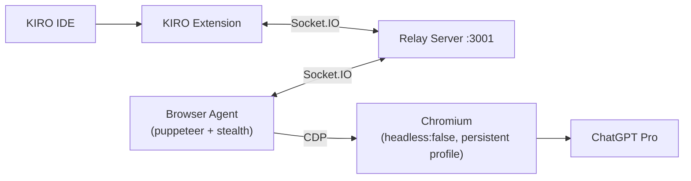

# KIRO-GPT Bridge

> **ChatGPT Pro + DALL-E inside KIRO IDE.**

KIRO-GPT Bridge is an opt-in extension for KIRO IDE that exposes ChatGPT Pro and DALL-E in a side panel without using the official OpenAI API. All model interactions are driven through a real Chromium window pointed at `chat.openai.com`, controlled by a local browser-agent process that relays streamed responses back to the IDE through a small relay server.

## Quick start

```bash
git clone https://github.com/Souvik988/image-gpt.git
cd image-gpt
npm install
npm run build
npm test
```

Then follow [Run Locally](#run-locally) to start the relay, the browser-agent, and (optionally) register the [MCP server](#mcp-server-configuration).

> **Heads up:** copy `.env.example` to `.env` and `.kiro/settings/mcp.json.example` to `.kiro/settings/mcp.json`, then fill in your own secrets. Both real files are gitignored and must never be committed.

---

## Table of Contents

- [Architecture](#architecture)
- [Repository Layout](#repository-layout)
- [Run Locally](#run-locally)
- [Environment Variables](#environment-variables)
- [Extension Settings](#extension-settings)
- [Out of Scope](#out-of-scope)
- [Docker Compose](#docker-compose)
- [Property-Based Testing](#property-based-testing)
- [MCP Server Configuration](#mcp-server-configuration)
- [Visual Asset Automation](#visual-asset-automation)

---

## Architecture

Three components on the workstation, plus a `shared/` package that holds the on-the-wire schema consumed by all of them. The relay server is the only network endpoint; the extension and the browser-agent both connect outbound to it. There is no direct extension ↔ agent connection.

```
[KIRO IDE] <-> [KIRO Extension] <-> [Relay Server] <-> [Browser Agent] <-> [ChatGPT Pro]
```



- **KIRO Extension** registers a webview panel, code-aware commands, sessions, and a public `generateImage` API.
- **Relay Server** authenticates clients and agents with shared secrets, dispatches Requests to idle agents, queues when all are busy, enforces no-loss / FIFO / mutual-exclusion invariants, and exposes `/health` and `/metrics`.
- **Browser Agent** drives a real, non-headless Chromium against ChatGPT Pro using a persistent profile, handles chat and image (DALL-E) requests, streams response chunks back, and pauses on `login_required`.

---

## Repository Layout

This is an npm-workspaces monorepo with five packages and a small set of root files.

```
kirogpt/
├── shared/             # wire schema, validators, errors, events, base64, backoff
├── relay-server/       # Express + Socket.IO dispatcher, /health, /metrics
├── browser-agent/      # puppeteer-extra + stealth; drives ChatGPT Pro
├── kiro-extension/     # KIRO IDE extension (panel, commands, sessions, generateImage API)
├── mcp-server/         # MCP server exposing image-generation tools to other agents
├── docker-compose.yml  # relay-only compose (browser-agent runs locally outside Docker)
├── package.json        # workspace root
├── tsconfig.base.json  # strict TS base config
├── vitest.config.ts    # default test config (excludes *.slow.test.ts)
├── vitest.config.slow.ts  # slow PBT config (P5, P10)
└── README.md
```

---

## Run Locally

### Prerequisites

- **Node.js 20+**
- **Docker** (optional — only needed if you want to run the relay containerized)
- A logged-in **ChatGPT Pro account**

### Install, build, test

```bash
npm install
npm run build
npm test
```

### Start the relay

The relay accepts two shared secrets (one for the extension, one for the agent) and binds to port 3001 by default.

```bash
cd relay-server
KIRO_SECRET=<your-kiro-secret> \
AGENT_SECRET=<your-agent-secret> \
node dist/index.js
```

Verify it is up:

```bash
curl http://localhost:3001/health
```

### Start the browser-agent (always local, never Docker)

The agent must run on **your local machine** because it needs a non-headless Chromium with a persistent profile that retains the ChatGPT Pro login. A real Chromium window will open the first time you run it — log in to ChatGPT Pro once, and the persistent profile will keep the session for subsequent runs.

```bash
cd browser-agent
AGENT_PROFILE_DIR=<absolute-path-to-writable-profile-dir> \
RELAY_URL=ws://localhost:3001 \
AGENT_SECRET=<your-agent-secret> \
node dist/index.js
```

### Install the extension into KIRO

1. Build the extension: `npm --workspace kiro-extension run build`.
2. Install the resulting package into KIRO IDE.
3. Open KIRO settings and set `kiroGptBridge.relayUrl` to `ws://localhost:3001` (or wherever your relay is running).
4. Open the **ChatGPT Bridge** panel from the side bar and submit a prompt.

---

## Environment Variables

### `relay-server/`

| Variable | Meaning | Default | Validation |
|---|---|---|---|
| `PORT` | TCP port the relay binds to | `3001` | integer, 1–65535 |
| `KIRO_SECRET` | Shared secret for KIRO extension clients | — (required) | string, 16–256 chars |
| `AGENT_SECRET` | Shared secret for browser-agent clients | — (required) | string, 16–256 chars |
| `RELAY_TLS_ENABLED` | Enable HTTPS / WSS | `false` | `"true"` or `"false"` |
| `RELAY_TLS_CERT` | Path to PEM certificate | — | readable PEM file when TLS enabled |
| `RELAY_TLS_KEY` | Path to PEM private key | — | readable PEM file when TLS enabled |
| `QUEUE_MAX_DEPTH` | Maximum pending-queue depth before `QUEUE_FULL` | `1000` | integer, 100–100000 |

Any invalid value causes the relay to log a structured error identifying the variable and exit non-zero.

### `browser-agent/`

| Variable | Meaning | Default | Validation |
|---|---|---|---|
| `RELAY_URL` | URL of the relay server | — (required) | `ws://` or `wss://` URL |
| `AGENT_SECRET` | Shared secret matching the relay's `AGENT_SECRET` | — (required) | string, 16–256 chars |
| `AGENT_PROFILE_DIR` | Absolute path to the persistent Chromium profile | — (required) | absolute path that exists and is writable |

### `mcp-server/`

| Variable | Meaning | Default | Validation |
|---|---|---|---|
| `KIRO_GPT_MCP_SECRET` | Shared secret used by the MCP server when connecting to the relay as a KIRO client (matches the relay's `KIRO_SECRET`) | — (required) | string, 16–256 chars |
| `KIRO_GPT_MCP_RELAY_URL` | `ws://` or `wss://` URL of the relay server | `ws://localhost:3001` | valid WebSocket URL |
| `KIRO_GPT_MCP_WORKSPACE` | Absolute path to the workspace where generated assets are written | — | absolute path; takes priority over the local-device default |
| `KIRO_GPT_MCP_DOWNLOAD_DIR` | Override for the local-device default download folder | `<home>/Downloads/kiro-gpt-bridge` | absolute path; used only when `KIRO_GPT_MCP_WORKSPACE` and the per-call `workspace_root` are both unset |

**Where files are saved (resolution order).** Every generated asset is written to the first of these that is set:

1. The per-call `workspace_root` tool argument.
2. The `KIRO_GPT_MCP_WORKSPACE` environment variable.
3. **The local-device default** — `<home>/Downloads/kiro-gpt-bridge` (or `KIRO_GPT_MCP_DOWNLOAD_DIR` if set).

This means the server **works out of the box with zero configuration**: install it, and generated images land in your own `Downloads/kiro-gpt-bridge` folder automatically. Point it at a project by setting `KIRO_GPT_MCP_WORKSPACE` (or passing `workspace_root`) when you want assets to land inside a specific codebase instead.

---

## Extension Settings

The KIRO extension contributes the following settings under `kiroGptBridge.*`.

| Setting | Type | Default | Description |
|---|---|---|---|
| `kiroGptBridge.relayUrl` | string | `""` | WebSocket URL of the relay server, e.g. `ws://localhost:3001`. Required for the panel to connect. |
| `kiroGptBridge.sessionHistoryMax` | integer | `50` | Maximum number of messages retained per session. Range: 1–200. |
| `kiroGptBridge.autoGenerateAssets` | boolean | `true` | Enable automatic visual-asset generation via hooks and CodeLens. See [Visual Asset Automation](#visual-asset-automation) below. |

---

## Out of Scope

These boundaries come directly from Requirement 28 and are enforced by the implementation and the network-boundary test suite.

- Does **NOT** replace, disable, or modify the KIRO IDE native AI assistant.
- Does **NOT** use the official OpenAI API. All model interactions are routed through the ChatGPT Pro web UI controlled by the browser-agent.
- Does **NOT** transmit prompts, code context, or responses to any third-party endpoint other than ChatGPT Pro. No analytics, telemetry, logging, or diagnostic endpoints.
- Does **NOT** persist prompts or responses outside the user's local machine, except via the user's explicit "Save as file" or "Save to workspace" actions.
- While the panel is not enabled, the bridge does not intercept editor commands, modify the native assistant, or initiate any outbound network connections.

---

## Docker Compose

A root [`docker-compose.yml`](./docker-compose.yml) (created in task 21.2) runs the relay as a container on port 3001 with a HEALTHCHECK directive polling `/health`.

```bash
docker compose up --build
```

The **browser-agent always runs locally outside Docker** because it needs a non-headless Chromium with a persistent profile — it must run on your workstation, not in a container. The compose file therefore only contains the `relay` service.

---

## Property-Based Testing

This project uses [fast-check](https://github.com/dubzzz/fast-check) for property-based testing under vitest. Every PBT file carries a strict tag comment so test ↔ design traceability is mechanical:

```ts
// Feature: kiro-gpt-bridge, Property <N>: <body>
```

Where `<N>` matches the numbered property in `design.md` and `<body>` paraphrases the property statement. PBTs run with `vitest --run` and `fc.assert(prop, { numRuns: 100 })` (or 200 / 500 for stateful or flake-prone properties).

Run modes:

```bash
npm test              # default config — fast PBTs
npm run test:slow     # gated long-running PBTs (large attachments, atomic writes)
```

The `slow` config (`vitest.config.slow.ts`) covers properties such as P5 (pretty-printer round-trip with 25 MB attachments) and P10 (atomic write under fault injection). They are excluded from default CI to keep the standard run under the 30 s per-test budget.

---

## MCP Server Configuration

Register the kiro-gpt-bridge MCP server in `.kiro/settings/mcp.json` so the Kiro main agent (or any other MCP client) picks up the visual-asset tools automatically. The server speaks MCP over **stdio** — Kiro spawns it as a child process and the `command`/`args`/`env` triple below is the standard Kiro stdio launch shape.

```json
{
  "mcpServers": {
    "kiro-gpt-bridge": {
      "command": "node",
      "args": ["./mcp-server/dist/index.js"],
      "env": {
        "KIRO_GPT_MCP_SECRET": "<your-kiro-secret>",
        "KIRO_GPT_MCP_RELAY_URL": "ws://localhost:3001",
        "KIRO_GPT_MCP_WORKSPACE": "<absolute-path-to-workspace-root>"
      },
      "disabled": false,
      "autoApprove": []
    }
  }
}
```

The three env vars are the only configuration the server reads:

- **`KIRO_GPT_MCP_SECRET`** (required) — the KIRO_Secret used in the relay handshake. Must match the relay's `KIRO_SECRET`; the server registers as a KIRO_Client. If unset, the process still starts so an MCP host can list tools, but every tool call returns `RELAY_UNREACHABLE`.
- **`KIRO_GPT_MCP_RELAY_URL`** (optional) — `ws://` or `wss://` URL of the relay. Defaults to `ws://localhost:3001` when unset.
- **`KIRO_GPT_MCP_WORKSPACE`** (optional) — absolute path to the workspace root that generated assets are written under. Per-tool calls may override it via a `workspace_root` argument. When neither is set, the server falls back to the **local-device default** (see below) so it still works.
- **`KIRO_GPT_MCP_DOWNLOAD_DIR`** (optional) — overrides the local-device default folder. Defaults to `<home>/Downloads/kiro-gpt-bridge`.

> **Local-device default:** if you don't point the server at a workspace, every generated file is saved to `<home>/Downloads/kiro-gpt-bridge` on the machine running the MCP server. This makes the published server usable immediately after install — no path configuration required.

Each tool builds a versioned prompt template, forwards an image Request to the relay, and writes the resulting image atomically into the framework-conventional asset folder. Tools return `{ ok: true, savedPath, mimeType, prompt, requestId, assetCategory }` on success (or `savedPaths: string[]` for `generate_icon_set`) and `{ ok: false, errorCode, message }` on failure with closed-enum codes including `RELAY_UNREACHABLE`, `WORKSPACE_REQUIRED`, `TARGET_EXISTS`, `INVALID_PROMPT`, `IMAGE_TIMEOUT`, and `CONTENT_POLICY`.

### Tool argument schemas

The five tools and their JSON-Schema arg shapes (reproduced from `mcp-server/src/index.ts`). Every tool also accepts the optional cross-cutting fields `framework` (one of `next`, `nuxt`, `sveltekit`, `vite`, `angular`, `cra`, `unknown` — defaults to auto-detection from the workspace), `workspace_root` (overrides `KIRO_GPT_MCP_WORKSPACE` for that call), and `overwrite` (boolean, defaults to `false`; when `false`, an existing target file produces `TARGET_EXISTS`).

#### `generate_image`

General-purpose fallback. Use when no specialized tool fits.

```json
{
  "type": "object",
  "required": ["prompt"],
  "properties": {
    "prompt":         { "type": "string", "minLength": 1, "maxLength": 4000 },
    "asset_category": { "type": "string", "enum": ["logo", "hero", "icon", "illustration", "background", "mockup", "other"] },
    "filename":       { "type": "string" },
    "framework":      { "type": "string", "enum": ["next", "nuxt", "sveltekit", "vite", "angular", "cra", "unknown"] },
    "workspace_root": { "type": "string" },
    "overwrite":      { "type": "boolean" }
  },
  "additionalProperties": false
}
```

#### `generate_logo`

Brand mark or product logo. Template centers the composition on a transparent background, so `style` should describe rendering (e.g. `"minimal vector"`, `"isometric 3D"`) rather than restate composition.

```json
{
  "type": "object",
  "required": ["brand_name"],
  "properties": {
    "brand_name":     { "type": "string", "minLength": 1 },
    "style":          { "type": "string" },
    "color_palette":  { "type": "string" },
    "framework":      { "type": "string", "enum": ["next", "nuxt", "sveltekit", "vite", "angular", "cra", "unknown"] },
    "workspace_root": { "type": "string" },
    "overwrite":      { "type": "boolean" }
  },
  "additionalProperties": false
}
```

#### `generate_hero`

Hero banner, splash image, or landing-page hero. `aspect_ratio` defaults to `"16:9"`.

```json
{
  "type": "object",
  "required": ["scene_description"],
  "properties": {
    "scene_description": { "type": "string", "minLength": 1 },
    "aspect_ratio":      { "type": "string" },
    "framework":         { "type": "string", "enum": ["next", "nuxt", "sveltekit", "vite", "angular", "cra", "unknown"] },
    "workspace_root":    { "type": "string" },
    "overwrite":         { "type": "boolean" }
  },
  "additionalProperties": false
}
```

#### `generate_icon_set`

Coherent icon set sharing a single `theme` and `style` (defaults to `"flat outline"`). Returns one image per name in `savedPaths: string[]`.

```json
{
  "type": "object",
  "required": ["theme", "names"],
  "properties": {
    "theme":          { "type": "string", "minLength": 1 },
    "names":          { "type": "array", "minItems": 1, "items": { "type": "string", "minLength": 1 } },
    "style":          { "type": "string" },
    "framework":      { "type": "string", "enum": ["next", "nuxt", "sveltekit", "vite", "angular", "cra", "unknown"] },
    "workspace_root": { "type": "string" },
    "overwrite":      { "type": "boolean" }
  },
  "additionalProperties": false
}
```

#### `generate_ui_mockup`

Visual mockup of a component. `viewport` defaults to `"desktop 1440x900"`.

```json
{
  "type": "object",
  "required": ["component_description"],
  "properties": {
    "component_description": { "type": "string", "minLength": 1 },
    "viewport":              { "type": "string" },
    "framework":             { "type": "string", "enum": ["next", "nuxt", "sveltekit", "vite", "angular", "cra", "unknown"] },
    "workspace_root":        { "type": "string" },
    "overwrite":             { "type": "boolean" }
  },
  "additionalProperties": false
}
```

### Usage guidance for the Kiro main agent

For when to call which tool, what descriptors compose well with each prompt template, and where files land per framework, see the workspace steering file [`.kiro/steering/visual-assets.md`](./.kiro/steering/visual-assets.md). It is the canonical reference the main agent reads before generating frontend code that needs a logo, hero, icon, illustration, background, or UI mockup.

---

## Visual Asset Automation

The kiro-gpt-bridge MCP server lets the Kiro main agent automatically
generate logos, hero images, icons, illustrations, backgrounds, and UI
mockups while writing frontend code, without needing the human to switch
into the panel.

The five MCP tools (`generate_logo`, `generate_hero`, `generate_icon_set`,
`generate_ui_mockup`, `generate_image`) and their argument schemas are
documented above under [MCP Server Configuration](#mcp-server-configuration);
the registration snippet for `.kiro/settings/mcp.json` lives there as well
and is not duplicated here.

### How it works

1. **Steering file** at [`.kiro/steering/visual-assets.md`](./.kiro/steering/visual-assets.md)
   instructs the main agent: when generating code under
   `**/*.{tsx,jsx,vue,svelte,html,css,scss,astro}`, call the matching MCP
   tool before finalizing, and reference the returned `savedPath`. The
   steering file also carries the full prompt-style guidance and the
   per-category subfolder mapping.

2. **Two hooks** in [`.kiro/hooks/`](./.kiro/hooks):
   - **`generate-missing-assets.kiro.hook`** (`fileEdited`) — on save of
     a frontend file, scans for missing image references and asks the
     agent to generate them via MCP tools. The hook is gated on
     `kiroGptBridge.autoGenerateAssets === true` and exits silently when
     the user has opted out.
   - **`generate-spec-assets.kiro.hook`** (`userTriggered`, "Generate
     visual assets for active spec") — reads the active spec's
     `design.md`, lists every visual asset, and generates them all into
     the workspace, then updates `design.md` to reference the
     `savedPath` values.

3. **Setting `kiroGptBridge.autoGenerateAssets`** (boolean, default `true`)
   is the single opt-out switch. It gates **all three** integration
   points:
   - The `generate-missing-assets` hook checks it before running.
   - The `generate-spec-assets` hook checks it before running.
   - The extension annotates `.kiro/steering/visual-assets.md` at runtime
     with a "DISABLED — auto-generation is off via user setting" notice
     when `false`, so the main agent stops calling the MCP tools and
     reverts to placeholder paths or asking the user for images.

   The underlying MCP tools themselves remain callable regardless — the
   setting only suppresses the automatic, agent-driven path.

### Where assets land

Generated files are written into framework-conventional folders under the
workspace root. The mapping is the canonical asset-placement table from
[`mcp-server/src/pathResolver.ts`](./mcp-server/src/pathResolver.ts)
(`BASE_DIR_BY_FRAMEWORK` × `SUBDIR_BY_CATEGORY`); the steering file
quotes the same table so generated code paths match the on-disk paths.

| Framework   | Base directory  | Example (logo)                  |
|-------------|-----------------|---------------------------------|
| `next`      | `public/`       | `public/logo/<slug>.png`        |
| `nuxt`      | `public/`       | `public/logo/<slug>.png`        |
| `vite`      | `public/`       | `public/logo/<slug>.png`        |
| `cra`       | `public/`       | `public/logo/<slug>.png`        |
| `sveltekit` | `static/`       | `static/logo/<slug>.png`        |
| `angular`   | `src/assets/`   | `src/assets/logo/<slug>.png`    |
| `unknown`   | `assets/`       | `assets/logo/<slug>.png`        |

Within the base directory, files are placed under a per-category
subfolder: `logo/`, `hero/`, `icons/`, `illustrations/`, `backgrounds/`,
`mockups/`, or directly under the base for `other`. The filename stem is
`slugify(prompt, 40)` and the extension is derived from the response
MIME type (`.png`, `.jpg`, `.webp`, `.gif`).

### Example workflow

You ask Kiro: "Build a Next.js landing page with a hero image."

1. Kiro plans the page.
2. Steering file kicks in: Kiro calls `generate_hero` with a scene
   description.
3. The MCP server submits an image request to the relay.
4. Browser-agent drives DALL-E with your ChatGPT Pro login.
5. Image returns; MCP server writes it to `public/hero/<slug>.png`.
6. Kiro generates `app/page.tsx` referencing the actual saved path.
7. On save, the `generate-missing-assets` hook scans for any other
   missing assets and generates them too.

The whole loop is automatic. The user only logs into ChatGPT Pro once
in the browser-agent's persistent profile.

### Recommended workflow

- Plan in `design.md`. List visual assets explicitly.
- Run the user-triggered hook **"Generate visual assets for active spec"**
  to materialize every asset into the workspace.
- Open the panel to spot-check or generate one-off images.
- Code lands referencing real paths — no `TODO: add image` placeholders.
